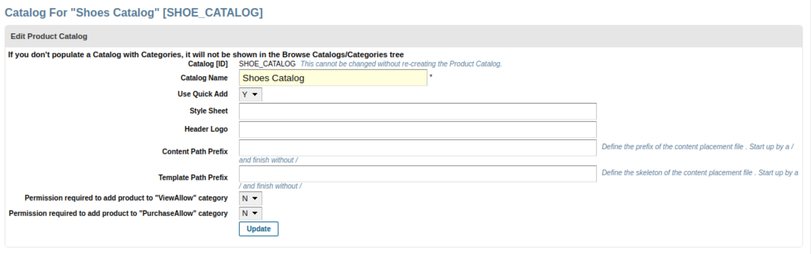
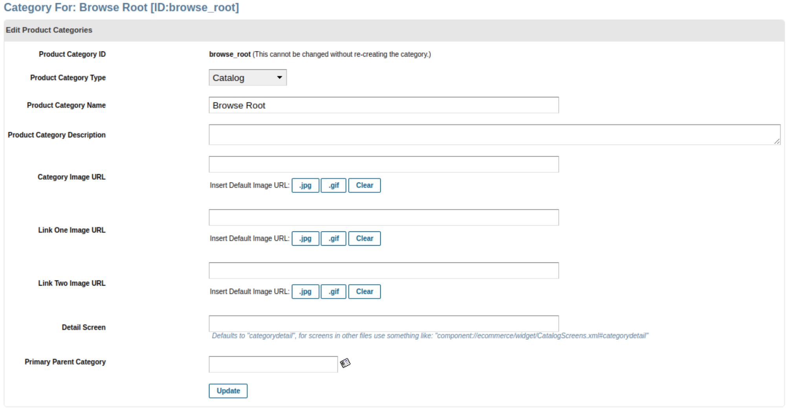
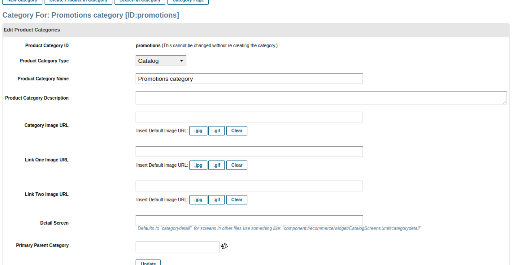
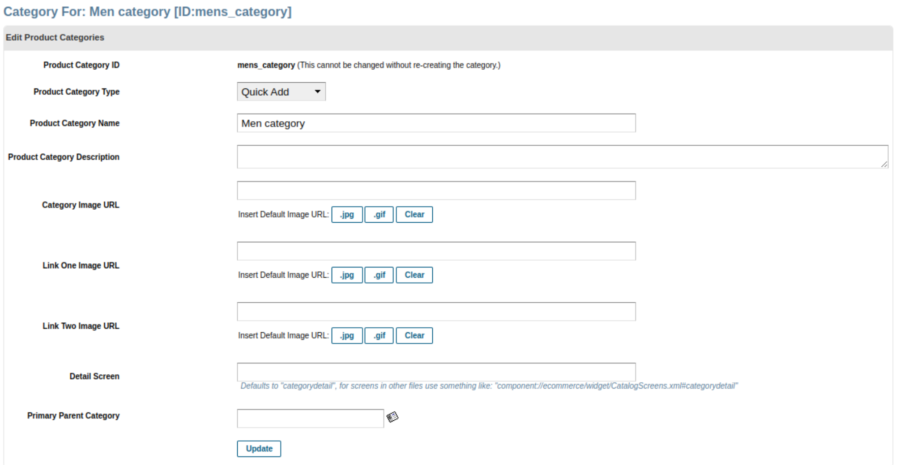
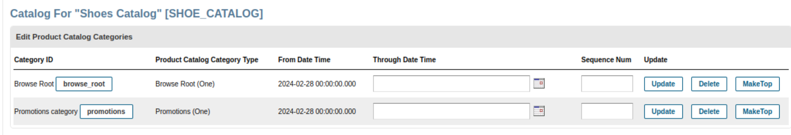
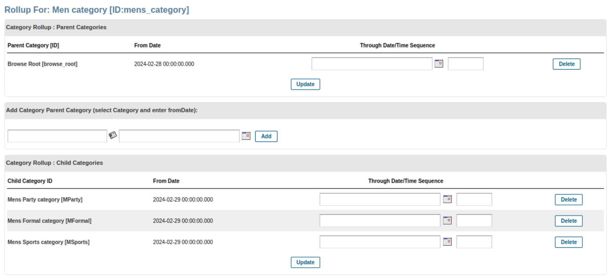
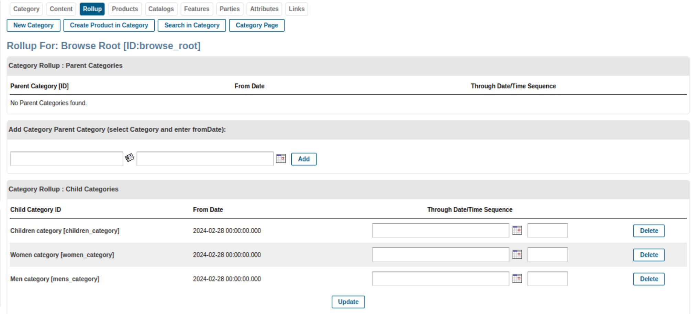
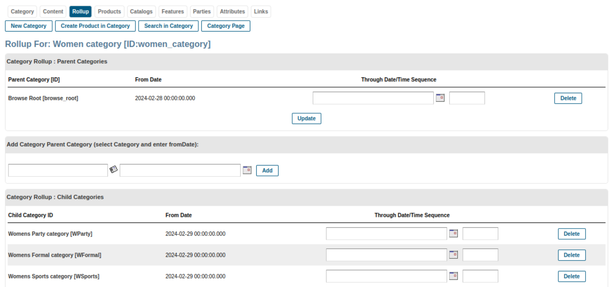
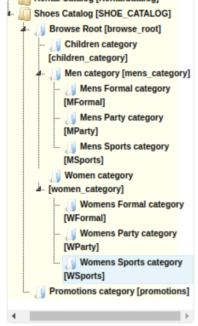

# Activity 1

## Shoes Catalog

**Categories**:

```text
Browse Root
– Men
— MSports
— MFormal
— MParty
– Women
— WSports
— WFormal
— WParty
– Children
Promotion
```

## Solution

### Creating the catalog

```xml
<ProdCatalog catalogName="Shoes Catalog" prodCatalogId="SHOE_CATALOG" />
```



### Creating Categories

1. Browse root category

   ```xml
   <ProductCategory
      categoryName="Browse Root"
      productCategoryId="browse_root"
      productCategoryTypeId="CATALOG_CATEGORY"
   />
   ```

   

2. Promotions category

   ```xml
   <ProductCategory
      categoryName="Promotions category"
      productCategoryId="promotions"
      productCategoryTypeId="CATALOG_CATEGORY"
   />
   ```

   

3. Men category

   ```xml
   <ProductCategory
      categoryName="Men category"
      productCategoryId="mens_category"
      productCategoryTypeId="QUICKADD_CATEGORY"
   />
   ```

   

4. Women category

   ```xml
   <ProductCategory
      categoryName="Women category"
      productCategoryId="women_category"
      productCategoryTypeId="QUICKADD_CATEGORY"
   />
   ```

   

5. Children category

   ```xml
   <ProductCategory
      categoryName="Children category"
      productCategoryId="children_category"
      productCategoryTypeId="QUICKADD_CATEGORY"
   />
   ```

   

6. In same way we create a categories of type `Quick Add` for all sub-categories of shoes

   - MSports
   - MFormal
   - MParty
   - WSports
   - WFormal
   - WParty

   ```xml
   <ProductCategory
      categoryName="Mens Sports category"
      productCategoryId="MSports"
      productCategoryTypeId="QUICKADD_CATEGORY"
   />
   <ProductCategory
      categoryName="Mens Formal category"
      productCategoryId="MFormal"
      productCategoryTypeId="QUICKADD_CATEGORY"
   />
   <ProductCategory
      categoryName="Mens Party category"
      productCategoryId="MParty"
      productCategoryTypeId="QUICKADD_CATEGORY"
   />
   <ProductCategory
      categoryName="Womens Sports category"
      productCategoryId="WSports"
      productCategoryTypeId="QUICKADD_CATEGORY"
   />
   <ProductCategory
      categoryName="Womens Formal category"
      productCategoryId="WFormal"
      productCategoryTypeId="QUICKADD_CATEGORY"
   />
   <ProductCategory
      categoryName="Womens Party category"
      productCategoryId="WParty"
      productCategoryTypeId="QUICKADD_CATEGORY"
   />
   ```

### Creating parent catalog categories

Adding `Browse Root` and `Promotions` category to the shoes catelog

- Adding browse root

  ```xml
   <ProdCatalogCategory
      fromDate="2024-02-28 00:00:00.0"
      prodCatalogCategoryTypeId="PCCT_BROWSE_ROOT"
      prodCatalogId="SHOE_CATALOG"
      productCategoryId="browse_root"
   />
  ```

- Adding promotions

  ```xml
   <ProdCatalogCategory
      fromDate="2024-02-28 00:00:00.0"
      prodCatalogCategoryTypeId="PCCT_PROMOTIONS"
      prodCatalogId="SHOE_CATALOG"
      productCategoryId="promotions"
   />
  ```


### Adding a sub-categories

Adding a `Mens`, `Womens` and `children` category as child category into browse root category

```xml
<ProductCategoryRollup
   fromDate="2024-02-28 00:00:00.0"
   parentProductCategoryId="browse_root"
   productCategoryId="mens_category"
/>
<ProductCategoryRollup
   fromDate="2024-02-28 00:00:00.0"
   parentProductCategoryId="browse_root"
   productCategoryId="women_category"
/>
<ProductCategoryRollup
   fromDate="2024-02-28 00:00:00.0"
   parentProductCategoryId="browse_root"
   productCategoryId="children_category"
/>
```



### Adding a sub-categories of `Mens` category

- `MSports`
- `MFormal`
- `MParty`

```xml
<ProductCategoryRollup
   fromDate="2024-02-29 00:00:00.0"
   parentProductCategoryId="mens_category"
   productCategoryId="MSports"
/>
<ProductCategoryRollup
   fromDate="2024-02-29 00:00:00.0"
   parentProductCategoryId="mens_category"
   productCategoryId="MFormal"
/>
<ProductCategoryRollup
   fromDate="2024-02-29 00:00:00.0"
   parentProductCategoryId="mens_category"
   productCategoryId="MParty"
/>
```


### Adding a sub-categories of `Womens` category

- `WSports`
- `WFormal`
- `WParty`

```xml
<ProductCategoryRollup
   fromDate="2024-02-29 00:00:00.0"
   parentProductCategoryId="women_category"
   productCategoryId="WSports"
/>
<ProductCategoryRollup
   fromDate="2024-02-29 00:00:00.0"
   parentProductCategoryId="women_category"
   productCategoryId="WFormal"
/>
<ProductCategoryRollup
   fromDate="2024-02-29 00:00:00.0"
   parentProductCategoryId="women_category"
   productCategoryId="WParty"
/>
```



### Categories tree


