# Activity 2

## Features

### Size

```text
– 2, 3, 4, 5, 7, 8, 9, 10, 11
```

### Color

```text
– Red, Black, White, Brown
```

## Products

```text
– Virtual Products
— Men > MSports
---- MS-1 with Color: White, Brown Size: 7, 8, 9, 10
---- MS-2 with Color: Red, Black Size: 7, 10
— Men > MFormal
---- MF-1 with Color: Red, Black Size: 7, 10
---- MF-2 with Color: White, Brown Size: 7, 8, 9, 10
— Men > MParty
---- MP-1 with Color: White, Brown Size: 7, 8, 9, 10
---- MP-2 with Color: Red, Black Size: 7, 8, 9, 10

— Women > WSports
---- WS-1 with Color: White, Brown Size: 7, 8, 9
---- WS-2 with Color: Red, Black Size: 7, 8
— Women > WFormal
---- WF-1 with Color: White, Brown Size: 7, 8, 9
---- WF-2 with Color: Red, Black Size: 7, 8, 9
— Women > WParty
---- WP-1 with Color: White, Brown Size: 7, 8
---- WP-2 with Color: Red, Black Size: 7, 8

– Children
— C-1 with Color: White, Brown Size: 2, 3, 4, 5
— C-2 with Color: Red, Black Size: 2, 3, 5
```

## Solution

### Creating features of type `size`

```xml
<ProductFeature
   description="size 7"
   productFeatureId="size-7"
   productFeatureTypeId="SIZE"
/>
<ProductFeature
   description="size 8"
   productFeatureId="size-8"
   productFeatureTypeId="SIZE"
/>
<ProductFeature
   description="size 9"
   productFeatureId="size-9"
   productFeatureTypeId="SIZE"
/>
<ProductFeature
   description="size 10"
   productFeatureId="size-10"
   productFeatureTypeId="SIZE"
/>
<ProductFeature
   description="size 11"
   productFeatureId="size-11"
   productFeatureTypeId="SIZE"
/>
<ProductFeature
   description="size 2"
   productFeatureId="size-2"
   productFeatureTypeId="SIZE"
/>
<ProductFeature
   description="size 3"
   productFeatureId="size-3"
   productFeatureTypeId="SIZE"
/>
<ProductFeature
   description="size 4"
   productFeatureId="size-4"
   productFeatureTypeId="SIZE"
/>
<ProductFeature
   description="size 5"
   productFeatureId="size-5"
   productFeatureTypeId="SIZE"
/>
```

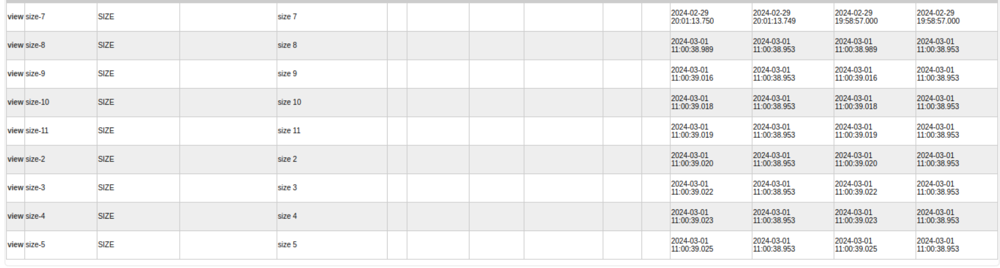

### Creating features of type `color`

```xml
<ProductFeature
   description="red color"
   productFeatureId="color-red"
   productFeatureTypeId="COLOR"
/>
<ProductFeature
   description="black color"
   productFeatureId="color-black"
   productFeatureTypeId="COLOR"
/>
<ProductFeature
   description="white color"
   productFeatureId="color-white"
   productFeatureTypeId="COLOR"
/>
<ProductFeature
   description="brown color"
   productFeatureId="color-brown"
   productFeatureTypeId="COLOR"
/>
```

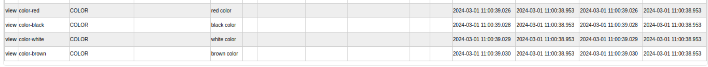

### Creating All the products

#### Products of Mens category

```xml
<Product
   productId="MS-1"
   productTypeId="FINISHED_GOOD"
   productName="Mens sports 1 shoes"
   internalName="Mens sports 1 shoes"
   isVirtual="Y"
/>
<Product
   productId="MS-2"
   productTypeId="FINISHED_GOOD"
   productName="Mens sports 2 shoes"
   internalName="Mens sports 2 shoes"
   isVirtual="Y"
/>
<Product
   productId="MF-1"
   productTypeId="FINISHED_GOOD"
   productName="Mens formal 1 shoes"
   internalName="Mens formal 1 shoes"
   isVirtual="Y"
/>
<Product
   productId="MF-2"
   productTypeId="FINISHED_GOOD"
   productName="Mens formal 2 shoes"
   internalName="Mens formal 2 shoes"
   isVirtual="Y"
/>
<Product
   productId="MP-1"
   productTypeId="FINISHED_GOOD"
   productName="Mens party 1 shoes"
   internalName="Mens party 1 shoes"
   isVirtual="Y"
/>
<Product
   productId="MP-2"
   productTypeId="FINISHED_GOOD"
   productName="Mens party 2 shoes"
   internalName="Mens party 2 shoes"
   isVirtual="Y"
/>
```

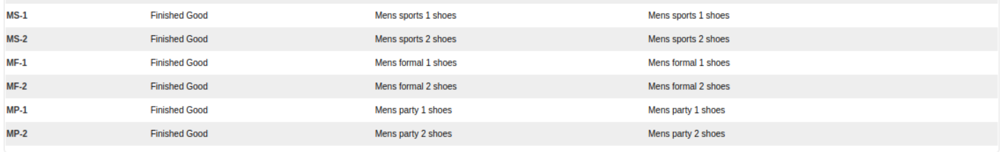

#### Products of Womens category

```xml
<Product
   productId="WS-1"
   productTypeId="FINISHED_GOOD"
   productName="Womens sports 1 shoes"
   internalName="Womens sports 1 shoes"
   isVirtual="Y"
/>
<Product
   productId="WS-2"
   productTypeId="FINISHED_GOOD"
   productName="Womens sports 2 shoes"
   internalName="Womens sports 2 shoes"
   isVirtual="Y"
/>
<Product
   productId="WF-1"
   productTypeId="FINISHED_GOOD"
   productName="Womens formal 1 shoes"
   internalName="Womens formal 1 shoes"
   isVirtual="Y"
/>
<Product
   productId="WF-2"
   productTypeId="FINISHED_GOOD"
   productName="Womens formal 2 shoes"
   internalName="Womens formal 2 shoes"
   isVirtual="Y"
/>
<Product
   productId="WP-1"
   productTypeId="FINISHED_GOOD"
   productName="Womens party 1 shoes"
   internalName="Womens party 1 shoes"
   isVirtual="Y"
/>
<Product
   productId="WP-2"
   productTypeId="FINISHED_GOOD"
   productName="Womens party 2 shoes"
   internalName="Womens party 2 shoes"
   isVirtual="Y"
/>
```

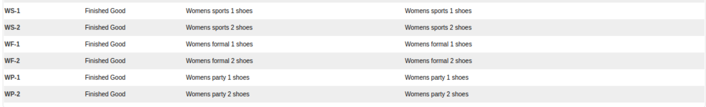

#### Products of Children category

```xml
<Product
   productId="C-1"
   productTypeId="FINISHED_GOOD"
   productName="Childrens 1 shoes"
   internalName="Childrens 1 shoes"
   isVirtual="Y"
/>
<Product
   productId="C-2"
   productTypeId="FINISHED_GOOD"
   productName="Childrens 2 shoes"
   internalName="Childrens 2 shoes"
   isVirtual="Y"
/>
```

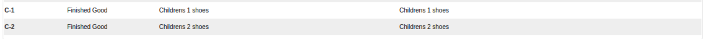

### Assiging features to the products accordingly

#### For `MS-1` product

```xml
<!--
   MS-1 with Color: White, Brown Size: 7, 8, 9, 10
 -->
<ProductFeatureAppl
   fromDate="2024-02-29 20:29:41.0"
   productFeatureApplTypeId="SELECTABLE_FEATURE"
   productFeatureId="size-7"
   productId="MS-1"
/>
<ProductFeatureAppl
   fromDate="2024-02-29 20:29:41.0"
   productFeatureApplTypeId="SELECTABLE_FEATURE"
   productFeatureId="size-8"
   productId="MS-1"
/>
<ProductFeatureAppl
   fromDate="2024-02-29 20:29:41.0"
   productFeatureApplTypeId="SELECTABLE_FEATURE"
   productFeatureId="size-9"
   productId="MS-1"
/>
<ProductFeatureAppl
   fromDate="2024-02-29 20:29:41.0"
   productFeatureApplTypeId="SELECTABLE_FEATURE"
   productFeatureId="size-10"
   productId="MS-1"
/>
<ProductFeatureAppl
   fromDate="2024-02-29 20:29:41.0"
   productFeatureApplTypeId="SELECTABLE_FEATURE"
   productFeatureId="color-white"
   productId="MS-1"
/>
<ProductFeatureAppl
   fromDate="2024-02-29 20:29:41.0"
   productFeatureApplTypeId="SELECTABLE_FEATURE"
   productFeatureId="color-brown"
   productId="MS-1"
/>
```

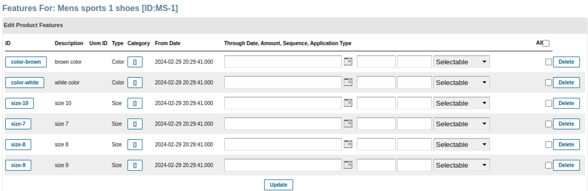

#### For `MS-2` product

```xml
<!-- MS-2 with Color: Red, Black Size: 7, 10 -->
<ProductFeatureAppl
   fromDate="2024-02-29 20:29:41.0"
   productFeatureApplTypeId="SELECTABLE_FEATURE"
   productFeatureId="size-7"
   productId="MS-2"
/>
<ProductFeatureAppl
   fromDate="2024-02-29 20:29:41.0"
   productFeatureApplTypeId="SELECTABLE_FEATURE"
   productFeatureId="size-10"
   productId="MS-2"
/>
<ProductFeatureAppl
   fromDate="2024-02-29 20:29:41.0"
   productFeatureApplTypeId="SELECTABLE_FEATURE"
   productFeatureId="color-red"
   productId="MS-2"
/>
<ProductFeatureAppl
   fromDate="2024-02-29 20:29:41.0"
   productFeatureApplTypeId="SELECTABLE_FEATURE"
   productFeatureId="color-black"
   productId="MS-2"
/>
```


#### For `MF-1` product

```xml
<!-- MF-1 with Color: Red, Black Size: 7, 10 -->
<ProductFeatureAppl
   fromDate="2024-02-29 20:29:41.0"
   productFeatureApplTypeId="SELECTABLE_FEATURE"
   productFeatureId="size-7"
   productId="MF-1"
/>
<ProductFeatureAppl
   fromDate="2024-02-29 20:29:41.0"
   productFeatureApplTypeId="SELECTABLE_FEATURE"
   productFeatureId="size-10"
   productId="MF-1"
/>
<ProductFeatureAppl
   fromDate="2024-02-29 20:29:41.0"
   productFeatureApplTypeId="SELECTABLE_FEATURE"
   productFeatureId="color-red"
   productId="MF-1"
/>
<ProductFeatureAppl
   fromDate="2024-02-29 20:29:41.0"
   productFeatureApplTypeId="SELECTABLE_FEATURE"
   productFeatureId="color-black"
   productId="MF-1"
/>
```

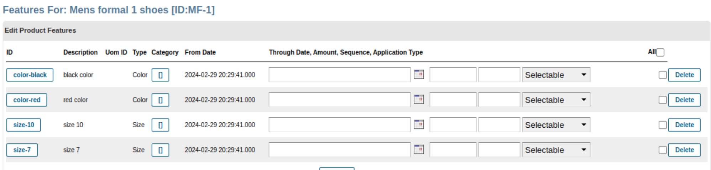

#### For `MF-2` product

```xml
<!--
   MF-2 with Color: White, Brown Size: 7, 8, 9, 10
 -->
<ProductFeatureAppl
   fromDate="2024-02-29 20:29:41.0"
   productFeatureApplTypeId="SELECTABLE_FEATURE"
   productFeatureId="size-7"
   productId="MF-2"
/>
<ProductFeatureAppl
   fromDate="2024-02-29 20:29:41.0"
   productFeatureApplTypeId="SELECTABLE_FEATURE"
   productFeatureId="size-8"
   productId="MF-2"
/>
<ProductFeatureAppl
   fromDate="2024-02-29 20:29:41.0"
   productFeatureApplTypeId="SELECTABLE_FEATURE"
   productFeatureId="size-9"
   productId="MF-2"
/>
<ProductFeatureAppl
   fromDate="2024-02-29 20:29:41.0"
   productFeatureApplTypeId="SELECTABLE_FEATURE"
   productFeatureId="size-10"
   productId="MF-2"
/>
<ProductFeatureAppl
   fromDate="2024-02-29 20:29:41.0"
   productFeatureApplTypeId="SELECTABLE_FEATURE"
   productFeatureId="color-white"
   productId="MF-2"
/>
<ProductFeatureAppl
   fromDate="2024-02-29 20:29:41.0"
   productFeatureApplTypeId="SELECTABLE_FEATURE"
   productFeatureId="color-brown"
   productId="MF-2"
/>
```


#### For `MP-1` product

```xml
<!--
   MP-1 with Color: White, Brown Size: 7, 8, 9, 10
 -->
<ProductFeatureAppl
   fromDate="2024-02-29 20:29:41.0"
   productFeatureApplTypeId="SELECTABLE_FEATURE"
   productFeatureId="size-7"
   productId="MP-1"
/>
<ProductFeatureAppl
   fromDate="2024-02-29 20:29:41.0"
   productFeatureApplTypeId="SELECTABLE_FEATURE"
   productFeatureId="size-8"
   productId="MP-1"
/>
<ProductFeatureAppl
   fromDate="2024-02-29 20:29:41.0"
   productFeatureApplTypeId="SELECTABLE_FEATURE"
   productFeatureId="size-9"
   productId="MP-1"
/>
<ProductFeatureAppl
   fromDate="2024-02-29 20:29:41.0"
   productFeatureApplTypeId="SELECTABLE_FEATURE"
   productFeatureId="size-10"
   productId="MP-1"
/>
<ProductFeatureAppl
   fromDate="2024-02-29 20:29:41.0"
   productFeatureApplTypeId="SELECTABLE_FEATURE"
   productFeatureId="color-white"
   productId="MP-1"
/>
<ProductFeatureAppl
   fromDate="2024-02-29 20:29:41.0"
   productFeatureApplTypeId="SELECTABLE_FEATURE"
   productFeatureId="color-brown"
   productId="MP-1"
/>
```

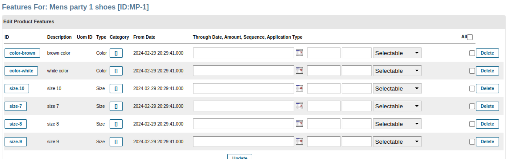

#### For `MP-2` product

```xml
<!--
   MP-2 with Color: Red, Black Size: 7, 8, 9, 10
 -->
<ProductFeatureAppl
   fromDate="2024-02-29 20:29:41.0"
   productFeatureApplTypeId="SELECTABLE_FEATURE"
   productFeatureId="size-7"
   productId="MP-2"
/>
<ProductFeatureAppl
   fromDate="2024-02-29 20:29:41.0"
   productFeatureApplTypeId="SELECTABLE_FEATURE"
   productFeatureId="size-8"
   productId="MP-2"
/>
<ProductFeatureAppl
   fromDate="2024-02-29 20:29:41.0"
   productFeatureApplTypeId="SELECTABLE_FEATURE"
   productFeatureId="size-9"
   productId="MP-2"
/>
<ProductFeatureAppl
   fromDate="2024-02-29 20:29:41.0"
   productFeatureApplTypeId="SELECTABLE_FEATURE"
   productFeatureId="size-10"
   productId="MP-2"
/>
<ProductFeatureAppl
   fromDate="2024-02-29 20:29:41.0"
   productFeatureApplTypeId="SELECTABLE_FEATURE"
   productFeatureId="color-black"
   productId="MP-2"
/>
<ProductFeatureAppl
   fromDate="2024-02-29 20:29:41.0"
   productFeatureApplTypeId="SELECTABLE_FEATURE"
   productFeatureId="color-red"
   productId="MP-2"
/>
```

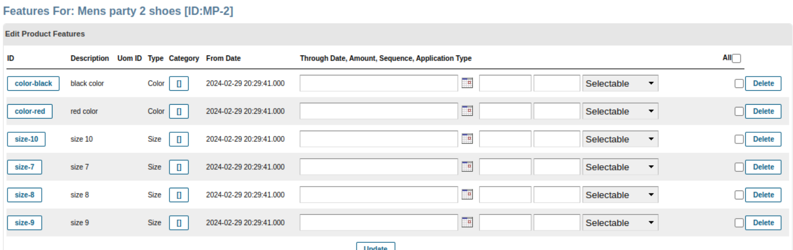

#### For `WS-1` product

```xml
<!--
   WS-1 with Color: White, Brown Size: 7, 8, 9
 -->
<ProductFeatureAppl
   fromDate="2024-02-29 20:29:41.0"
   productFeatureApplTypeId="SELECTABLE_FEATURE"
   productFeatureId="size-7"
   productId="WS-1"
/>
<ProductFeatureAppl
   fromDate="2024-02-29 20:29:41.0"
   productFeatureApplTypeId="SELECTABLE_FEATURE"
   productFeatureId="size-8"
   productId="WS-1"
/>
<ProductFeatureAppl
   fromDate="2024-02-29 20:29:41.0"
   productFeatureApplTypeId="SELECTABLE_FEATURE"
   productFeatureId="size-9"
   productId="WS-1"
/>
<ProductFeatureAppl
   fromDate="2024-02-29 20:29:41.0"
   productFeatureApplTypeId="SELECTABLE_FEATURE"
   productFeatureId="color-white"
   productId="WS-1"
/>
<ProductFeatureAppl
   fromDate="2024-02-29 20:29:41.0"
   productFeatureApplTypeId="SELECTABLE_FEATURE"
   productFeatureId="color-brown"
   productId="WS-1"
/>
```


#### For `WS-2` product

```xml
<!--
   WS-2 with Color: Red, Black Size: 7, 8
 -->
<ProductFeatureAppl
   fromDate="2024-02-29 20:29:41.0"
   productFeatureApplTypeId="SELECTABLE_FEATURE"
   productFeatureId="size-7"
   productId="WS-2"
/>
<ProductFeatureAppl
   fromDate="2024-02-29 20:29:41.0"
   productFeatureApplTypeId="SELECTABLE_FEATURE"
   productFeatureId="size-8"
   productId="WS-2"
/>
<ProductFeatureAppl
   fromDate="2024-02-29 20:29:41.0"
   productFeatureApplTypeId="SELECTABLE_FEATURE"
   productFeatureId="color-red"
   productId="WS-2"
/>
<ProductFeatureAppl
   fromDate="2024-02-29 20:29:41.0"
   productFeatureApplTypeId="SELECTABLE_FEATURE"
   productFeatureId="color-black"
   productId="WS-2"
/>
```


#### For `WF-1` product

```xml
<!-- WF-1 with Color: White, Brown Size: 7, 8, 9 -->
<ProductFeatureAppl
   fromDate="2024-02-29 20:29:41.0"
   productFeatureApplTypeId="SELECTABLE_FEATURE"
   productFeatureId="size-7"
   productId="WF-1"
/>
<ProductFeatureAppl
   fromDate="2024-02-29 20:29:41.0"
   productFeatureApplTypeId="SELECTABLE_FEATURE"
   productFeatureId="size-8"
   productId="WF-1"
/>
<ProductFeatureAppl
   fromDate="2024-02-29 20:29:41.0"
   productFeatureApplTypeId="SELECTABLE_FEATURE"
   productFeatureId="size-9"
   productId="WF-1"
/>
<ProductFeatureAppl
   fromDate="2024-02-29 20:29:41.0"
   productFeatureApplTypeId="SELECTABLE_FEATURE"
   productFeatureId="color-white"
   productId="WF-1"
/>
<ProductFeatureAppl
   fromDate="2024-02-29 20:29:41.0"
   productFeatureApplTypeId="SELECTABLE_FEATURE"
   productFeatureId="color-brown"
   productId="WF-1"
/>
```

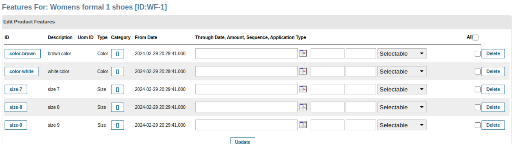

#### For `WF-2` product

```xml
<!-- WF-2 with Color: Red, Black Size: 7, 8, 9 -->
<ProductFeatureAppl
   fromDate="2024-02-29 20:29:41.0"
   productFeatureApplTypeId="SELECTABLE_FEATURE"
   productFeatureId="size-7"
   productId="WF-2"
/>
<ProductFeatureAppl
   fromDate="2024-02-29 20:29:41.0"
   productFeatureApplTypeId="SELECTABLE_FEATURE"
   productFeatureId="size-8"
   productId="WF-2"
/>
<ProductFeatureAppl
   fromDate="2024-02-29 20:29:41.0"
   productFeatureApplTypeId="SELECTABLE_FEATURE"
   productFeatureId="size-9"
   productId="WF-2"
/>
<ProductFeatureAppl
   fromDate="2024-02-29 20:29:41.0"
   productFeatureApplTypeId="SELECTABLE_FEATURE"
   productFeatureId="color-red"
   productId="WF-2"
/>
<ProductFeatureAppl
   fromDate="2024-02-29 20:29:41.0"
   productFeatureApplTypeId="SELECTABLE_FEATURE"
   productFeatureId="color-black"
   productId="WF-2"
/>
```

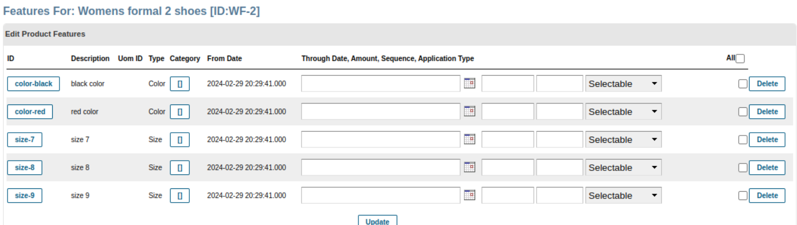

#### For `WP-1` product

```xml
<!-- WP-1 with Color: White, Brown Size: 7, 8 -->
<ProductFeatureAppl
   fromDate="2024-02-29 20:29:41.0"
   productFeatureApplTypeId="SELECTABLE_FEATURE"
   productFeatureId="size-7"
   productId="WP-1"
/>
<ProductFeatureAppl
   fromDate="2024-02-29 20:29:41.0"
   productFeatureApplTypeId="SELECTABLE_FEATURE"
   productFeatureId="size-8"
   productId="WP-1"
/>
<ProductFeatureAppl
   fromDate="2024-02-29 20:29:41.0"
   productFeatureApplTypeId="SELECTABLE_FEATURE"
   productFeatureId="color-white"
   productId="WP-1"
/>
<ProductFeatureAppl
   fromDate="2024-02-29 20:29:41.0"
   productFeatureApplTypeId="SELECTABLE_FEATURE"
   productFeatureId="color-brown"
   productId="WP-1"
/>
```

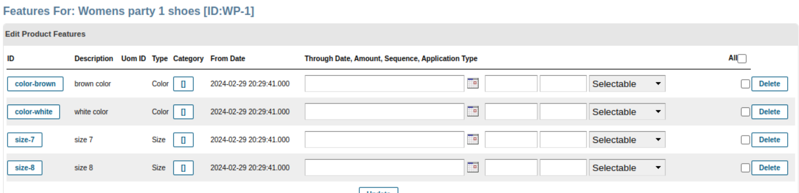

#### For `WP-2` product

```xml
<!--
   WP-2 with Color: Red, Black Size: 7, 8
 -->
<ProductFeatureAppl
   fromDate="2024-02-29 20:29:41.0"
   productFeatureApplTypeId="SELECTABLE_FEATURE"
   productFeatureId="size-7"
   productId="WP-2"
/>
<ProductFeatureAppl
   fromDate="2024-02-29 20:29:41.0"
   productFeatureApplTypeId="SELECTABLE_FEATURE"
   productFeatureId="size-8"
   productId="WP-2"
/>
<ProductFeatureAppl
   fromDate="2024-02-29 20:29:41.0"
   productFeatureApplTypeId="SELECTABLE_FEATURE"
   productFeatureId="color-red"
   productId="WP-2"
/>
<ProductFeatureAppl
   fromDate="2024-02-29 20:29:41.0"
   productFeatureApplTypeId="SELECTABLE_FEATURE"
   productFeatureId="color-black"
   productId="WP-2"
/>
```

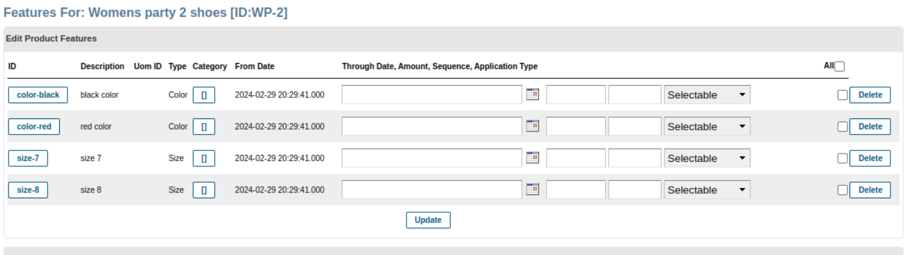

#### For `C-1` product

```xml
<!--
   C-1 with Color: White, Brown Size: 2, 3, 4, 5
 -->
<ProductFeatureAppl
   fromDate="2024-02-29 20:29:41.0"
   productFeatureApplTypeId="SELECTABLE_FEATURE"
   productFeatureId="size-2"
   productId="C-1"
/>
<ProductFeatureAppl
   fromDate="2024-02-29 20:29:41.0"
   productFeatureApplTypeId="SELECTABLE_FEATURE"
   productFeatureId="size-3"
   productId="C-1"
/>
<ProductFeatureAppl
   fromDate="2024-02-29 20:29:41.0"
   productFeatureApplTypeId="SELECTABLE_FEATURE"
   productFeatureId="size-4"
   productId="C-1"
/>
<ProductFeatureAppl
   fromDate="2024-02-29 20:29:41.0"
   productFeatureApplTypeId="SELECTABLE_FEATURE"
   productFeatureId="size-5"
   productId="C-1"
/>
<ProductFeatureAppl
   fromDate="2024-02-29 20:29:41.0"
   productFeatureApplTypeId="SELECTABLE_FEATURE"
   productFeatureId="color-white"
   productId="C-1"
/>
<ProductFeatureAppl
   fromDate="2024-02-29 20:29:41.0"
   productFeatureApplTypeId="SELECTABLE_FEATURE"
   productFeatureId="color-brown"
   productId="C-1"
/>
```

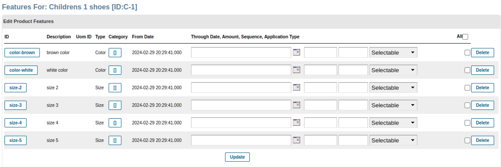

#### For `C-2` product

```xml
<!--
   C-2 with Color: Red, Black Size: 2, 3, 5
 -->
<ProductFeatureAppl
   fromDate="2024-02-29 20:29:41.0"
   productFeatureApplTypeId="SELECTABLE_FEATURE"
   productFeatureId="size-2"
   productId="C-2"
/>
<ProductFeatureAppl
   fromDate="2024-02-29 20:29:41.0"
   productFeatureApplTypeId="SELECTABLE_FEATURE"
   productFeatureId="size-3"
   productId="C-2"
/>
<ProductFeatureAppl
   fromDate="2024-02-29 20:29:41.0"
   productFeatureApplTypeId="SELECTABLE_FEATURE"
   productFeatureId="size-5"
   productId="C-2"
/>
<ProductFeatureAppl
   fromDate="2024-02-29 20:29:41.0"
   productFeatureApplTypeId="SELECTABLE_FEATURE"
   productFeatureId="color-red"
   productId="C-2"
/>
<ProductFeatureAppl
   fromDate="2024-02-29 20:29:41.0"
   productFeatureApplTypeId="SELECTABLE_FEATURE"
   productFeatureId="color-black"
   productId="C-2"
/>
```

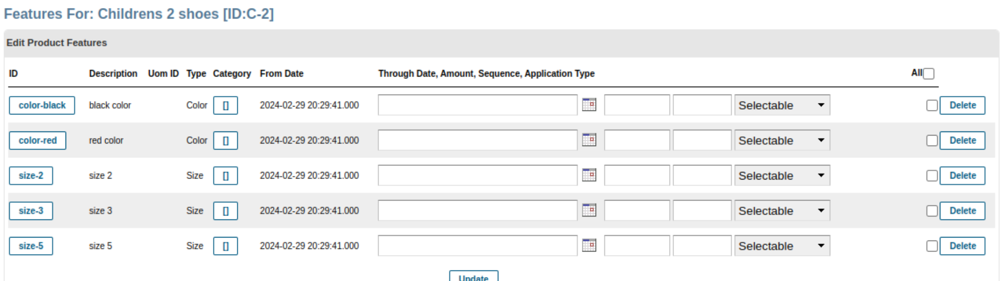

### Adding Products into their respective categories

#### Mens sports category products

```xml
<ProductCategoryMember
   fromDate="2024-02-29 20:29:41.0"
   productCategoryId="MSports"
   productId="MS-1"
/>
<ProductCategoryMember
   fromDate="2024-02-29 20:29:41.0"
   productCategoryId="MSports"
   productId="MS-2"
/>
```


#### Mens party category products

```xml
<ProductCategoryMember
   fromDate="2024-02-29 20:29:41.0"
   productCategoryId="MParty"
   productId="MP-1"
/>
<ProductCategoryMember
   fromDate="2024-02-29 20:29:41.0"
   productCategoryId="MParty"
   productId="MP-2"
/>
```

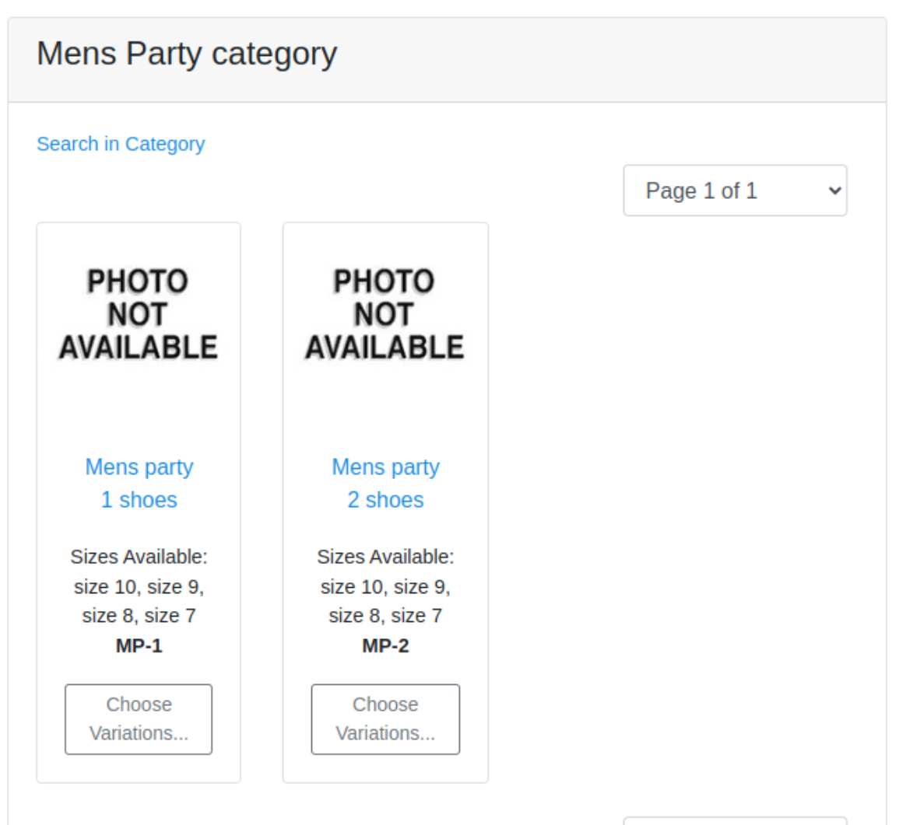

#### Mens formal category products

```xml
<ProductCategoryMember
   fromDate="2024-02-29 20:29:41.0"
   productCategoryId="MFormal"
   productId="MF-1"
/>
<ProductCategoryMember
   fromDate="2024-02-29 20:29:41.0"
   productCategoryId="MFormal"
   productId="MF-2"
/>
```

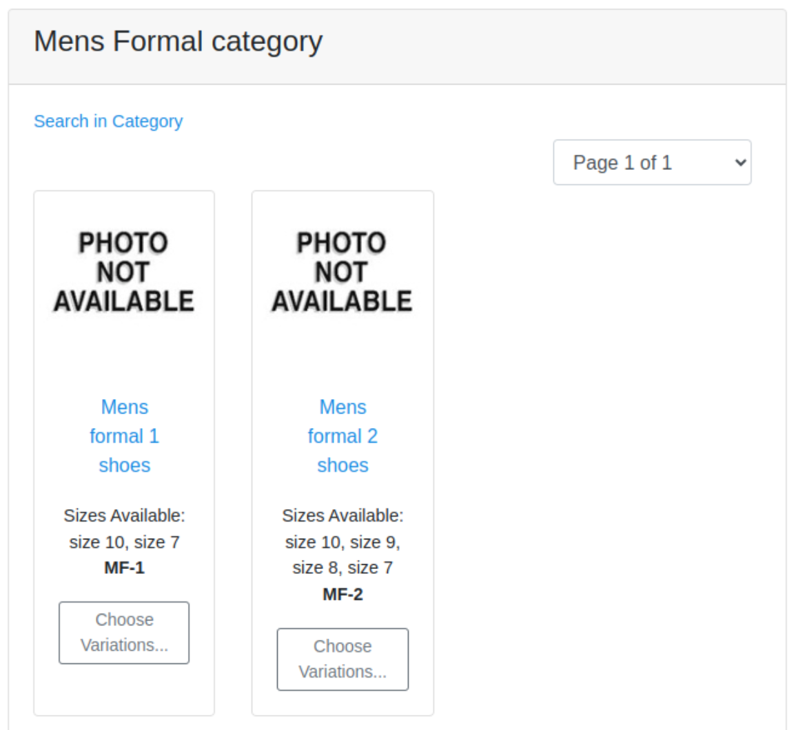

#### Womens sports category products

```xml
<ProductCategoryMember
   fromDate="2024-02-29 20:29:41.0"
   productCategoryId="WSports"
   productId="WS-1"
/>
<ProductCategoryMember
   fromDate="2024-02-29 20:29:41.0"
   productCategoryId="WSports"
   productId="WS-2"
/>
```

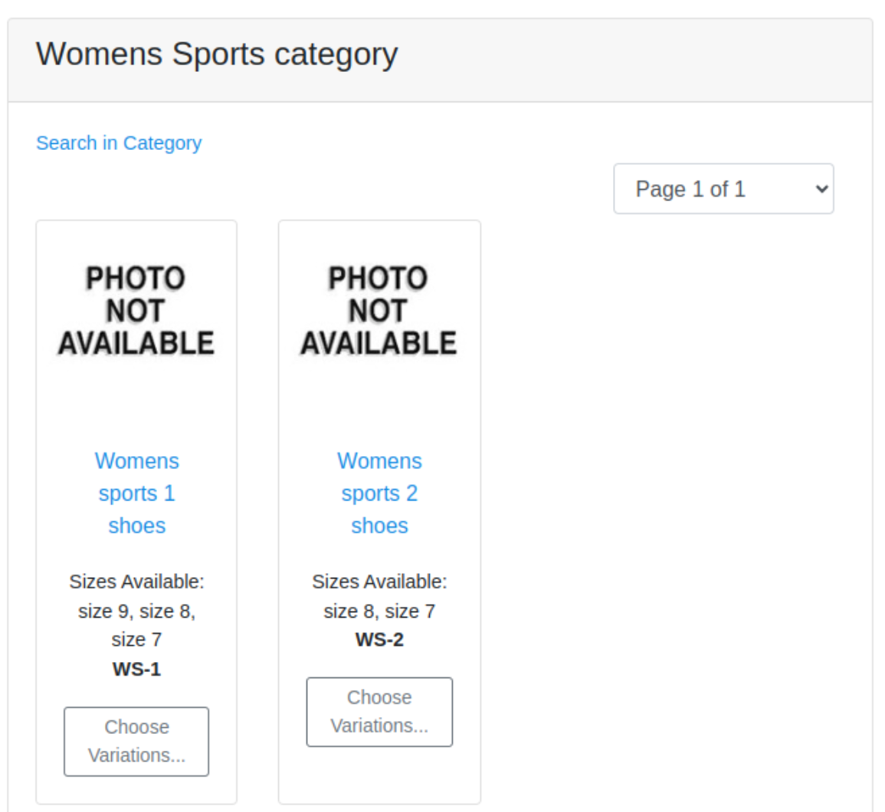

#### Womens party category products

```xml
<ProductCategoryMember
   fromDate="2024-02-29 20:29:41.0"
   productCategoryId="WParty"
   productId="WP-1"
/>
<ProductCategoryMember
   fromDate="2024-02-29 20:29:41.0"
   productCategoryId="WParty"
   productId="WP-2"
/>
```


#### Womens formal category products

```xml
<ProductCategoryMember
   fromDate="2024-02-29 20:29:41.0"
   productCategoryId="WFormal"
   productId="WF-1"
/>
<ProductCategoryMember
   fromDate="2024-02-29 20:29:41.0"
   productCategoryId="WFormal"
   productId="WF-2"
/>
```

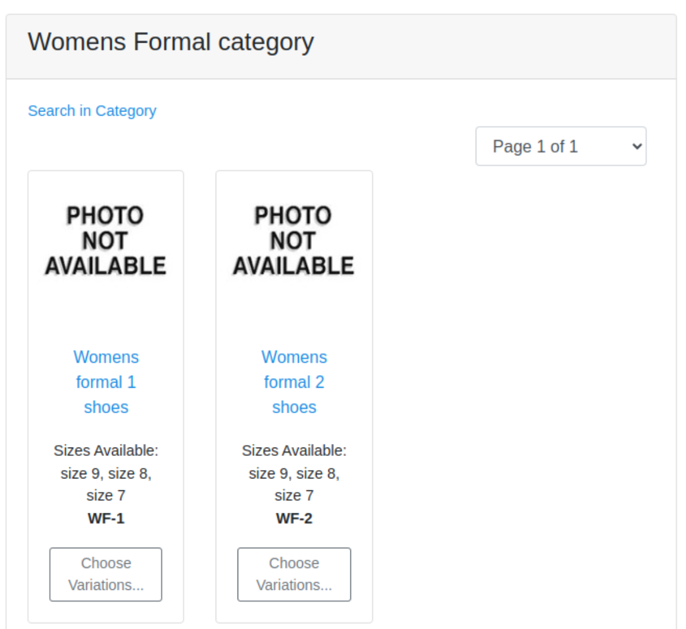

#### Children category products

```xml
<ProductCategoryMember
   fromDate="2024-02-29 20:29:41.0"
   productCategoryId="children_category"
   productId="C-1"
/>
<ProductCategoryMember
   fromDate="2024-02-29 20:29:41.0"
   productCategoryId="children_category"
   productId="C-2"
/>
```

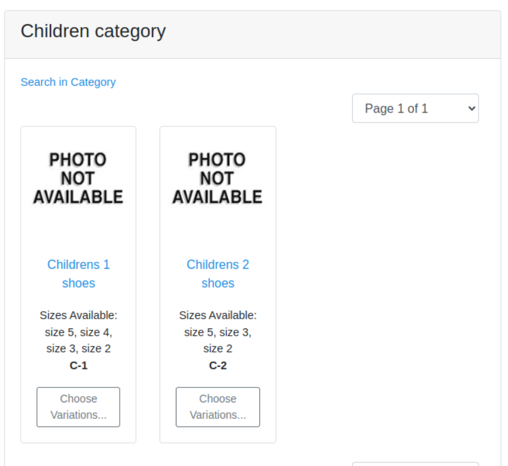
