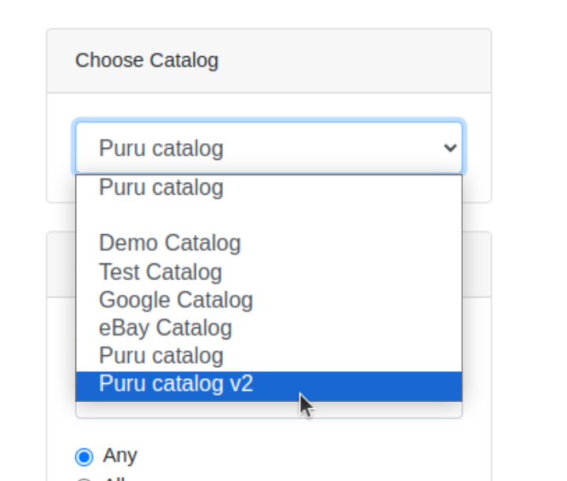
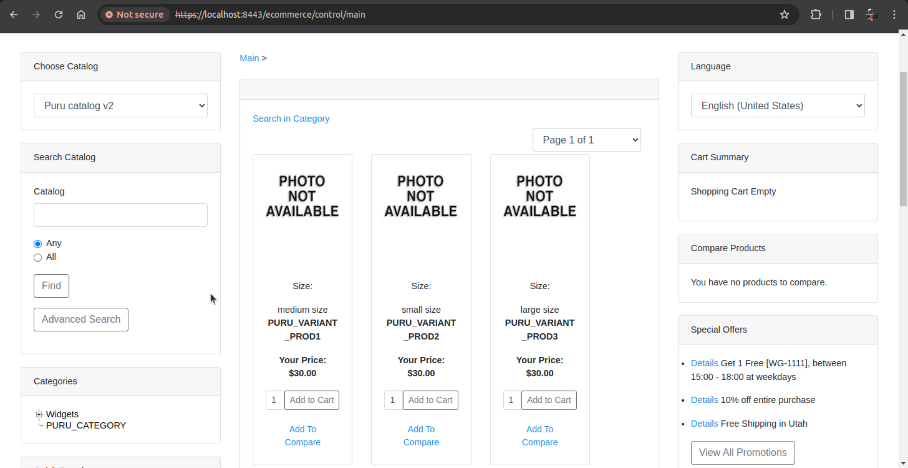
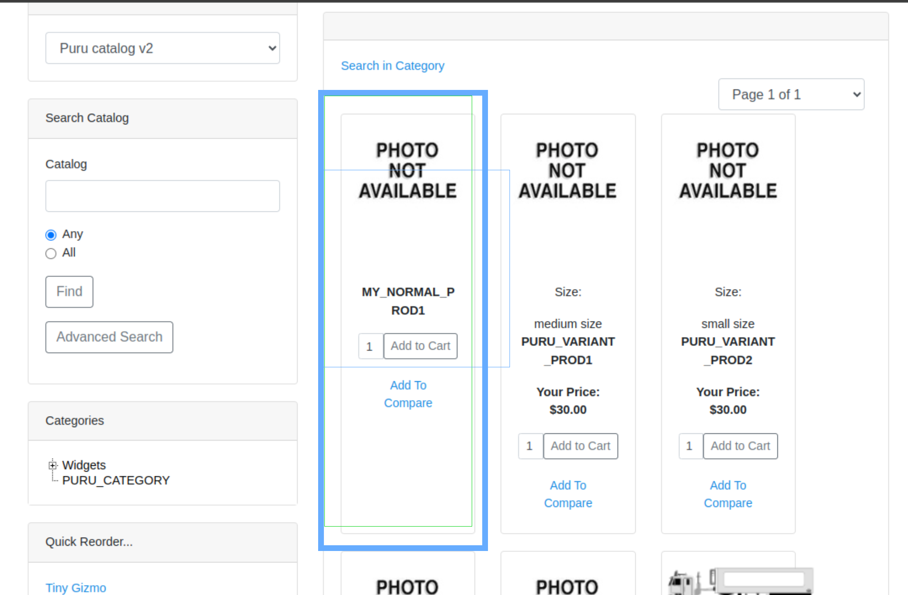
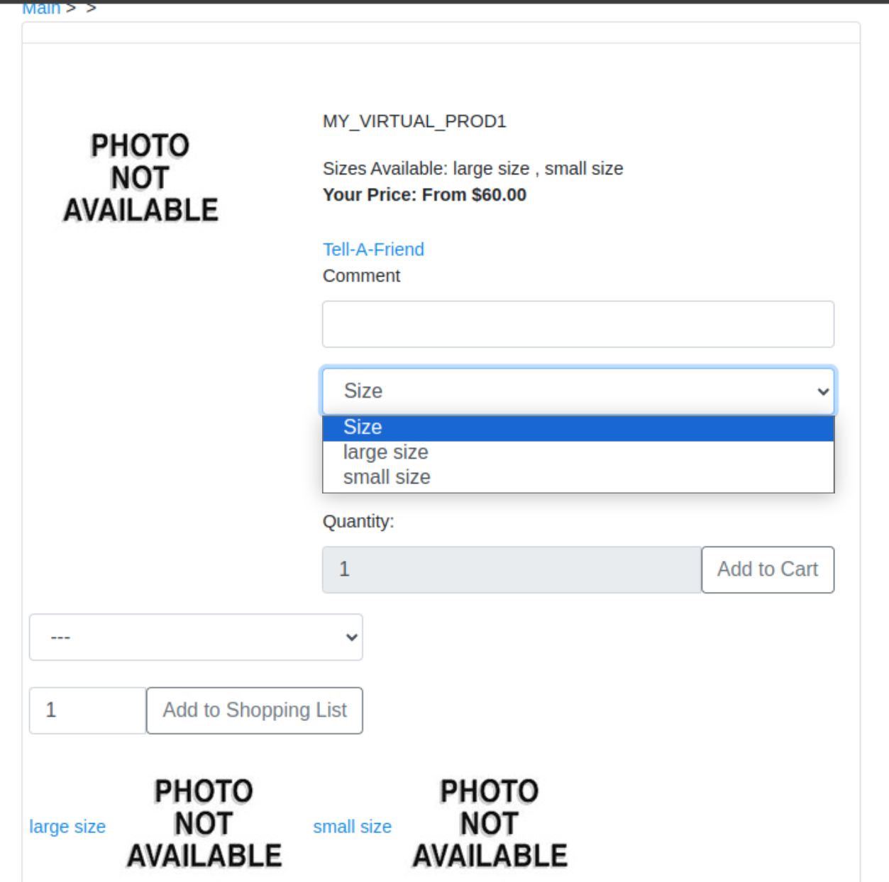
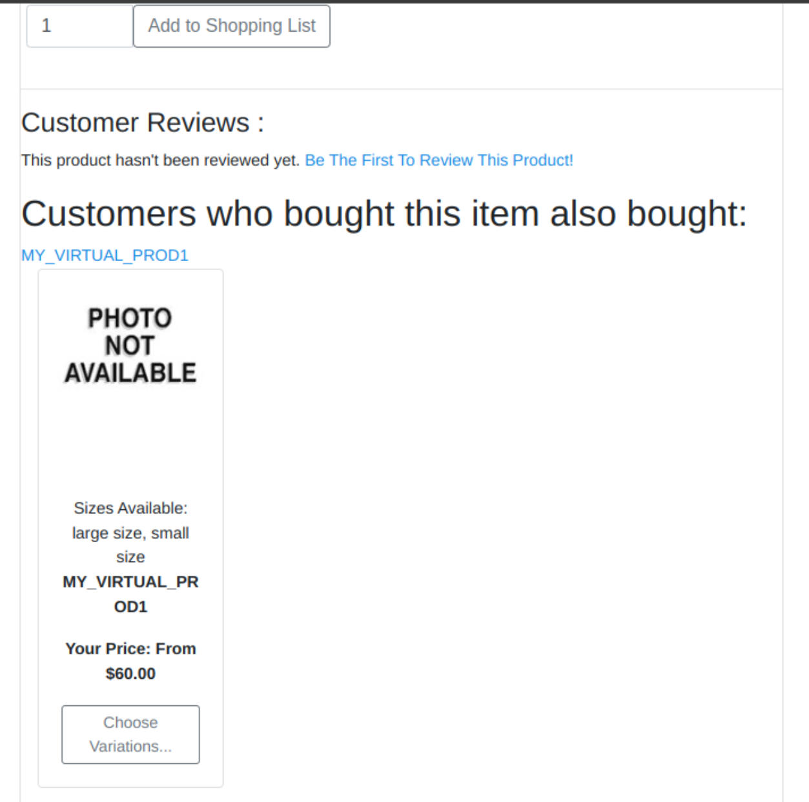
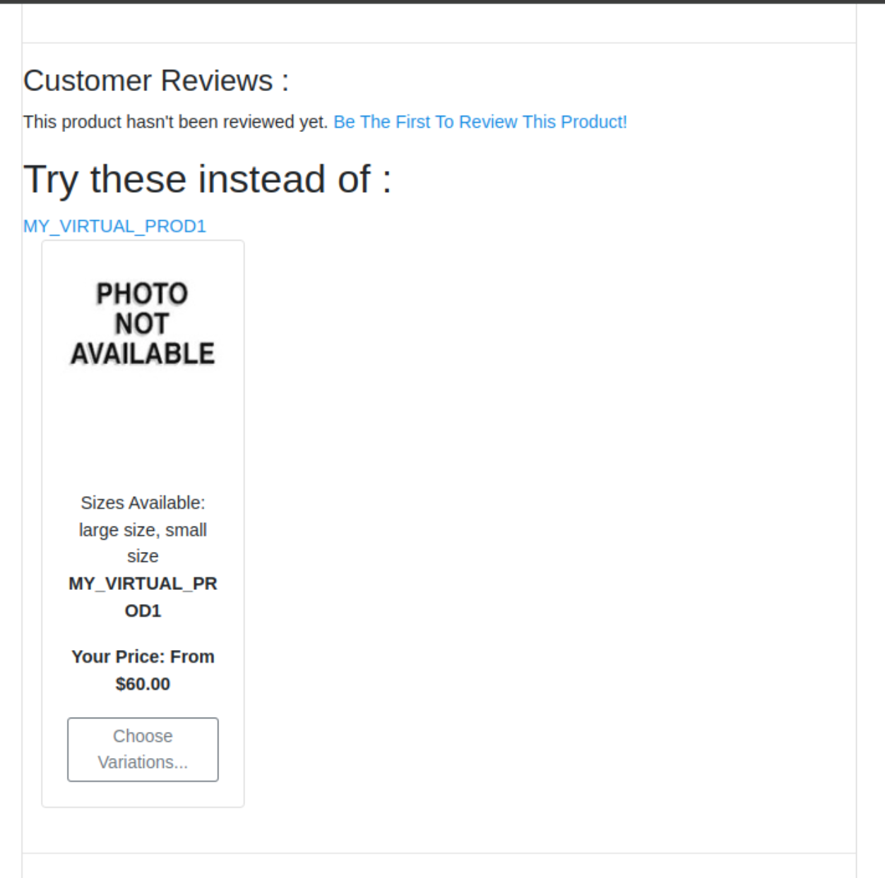
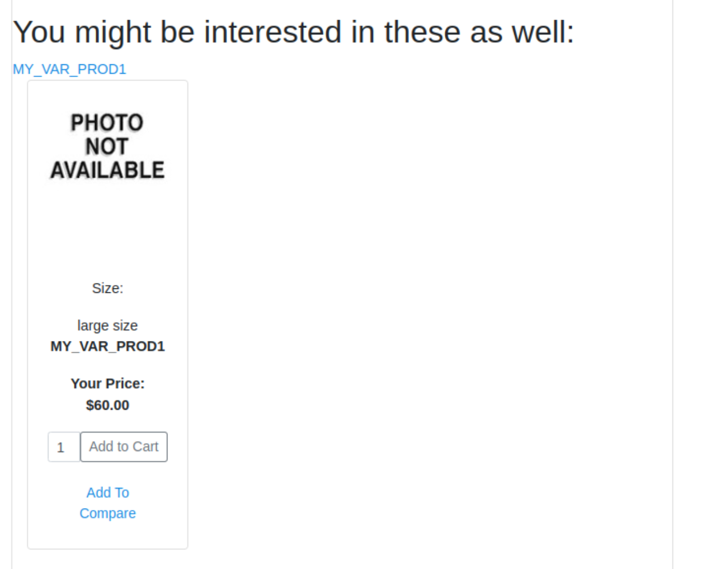

# Temp

## Creating a catalog to show on the e-commerce application

1. Create a catalog

    ```xml
    <ProdCatalog
        catalogName="Puru catalog v2"
        prodCatalogId="9002"
    />
    ```

2. Creating a catalog category

    ```xml
    <ProductCategory
        productCategoryId="PURU_CATALOG_CATEv2"
        productCategoryTypeId="CATALOG_CATEGORY"
    />
    ```

3. Creating a entry in `ProdCatalogCategory` table

    ```xml
    <ProdCatalogCategory
        prodCatalogId="9002"
        productCategoryId="PURU_CATALOG_CATEv2"
        prodCatalogCategoryTypeId="PCCT_BROWSE_ROOT"
        fromDate="2024-01-18 00:00:00.0"
    />
    ```

4. Creating a catalog entry for a product store 9000

    ```xml
    <ProductStoreCatalog
        fromDate="2024-01-27 09:54:09.472"
        prodCatalogId="9002"
        productStoreId="9000"
    />
    ```



## Adding sub categories to the catalog to add products

```xml
<ProductCategoryRollup
    parentProductCategoryId="PURU_CATALOG_CATEv2"
    productCategoryId="BEST-SELL-2"
    fromDate="2024-01-30 00:00:00.0"
/>

<ProductCategoryRollup
    parentProductCategoryId="PURU_CATALOG_CATEv2"
    productCategoryId="PURU_CATEGORY"
    fromDate="2024-01-30 00:00:00.0"
/>
```



## Creating the normal product and adding into category

1. Create a normal finished good product

    ```xml
    <Product
        internalName="my normal product 1"
        productId="MY_NORMAL_PROD1"
        productTypeId="FINISHED_GOOD"
    />
    ```

2. Adding price to normal product

    ```xml
    <ProductPrice
        productId="MY_NORMAL_PROD1"
        productPricePurposeId="PURCHASE"
        productPriceTypeId="DEFAULT_PRICE"
        currencyUomId="USD"
        fromDate="2024-02-21 14:57:28.0"
        price="90.000"
        productStoreGroupId="_NA_"
    />
    ```

3. Adding into a `PURU_CATEGORY` category

    ```xml
    <ProductCategoryMember
        productId="MY_NORMAL_PROD1"
        productCategoryId="PURU_CATEGORY"
        fromDate="2024-01-30 00:00:00.0"
    />
    ```



## Creating the variants and virtual products

1. Creating a virtual product

    ```xml
    <Product
        internalName="my virtual product 1"
        productId="MY_VIRTUAL_PROD1"
        productTypeId="FINISHED_GOOD"
        isVirtual="Y"
        virtualVariantMethodEnum="VV_VARIANTTREE"
    />
    ```

2. Creating two variants product of a virtual one

    ```xml
    <Product
        internalName="my variant product 1"
        productId="MY_VAR_PROD1"
        productTypeId="FINISHED_GOOD"
        isVariant="Y"
    />

    <Product
        internalName="my variant product 2"
        productId="MY_VAR_PROD2"
        productTypeId="FINISHED_GOOD"
        isVariant="Y"
    />
    ```

3. Creating product Assocication for the variants and virtual

    ```xml
    <ProductAssoc
        productId="MY_VIRTUAL_PROD1"
        productIdTo="MY_VAR_PROD1"
        productAssocTypeId="PRODUCT_VARIANT"
        fromDate="2024-01-30 00:00:00.0"
    />

    <ProductAssoc
        productId="MY_VIRTUAL_PROD1"
        productIdTo="MY_VAR_PROD2"
        productAssocTypeId="PRODUCT_VARIANT"
        fromDate="2024-01-30 00:00:00.0"
    />
    ```

## Creating features and adding into products

1. Create a two fetures of type size

    ```xml
    <ProductFeature
        description="small size"
        productFeatureId="my_small_size_feat"
        productFeatureTypeId="SIZE"
    />
    <ProductFeature
        description="large size"
        productFeatureId="my_large_size_feat"
        productFeatureTypeId="SIZE"
    />
    ```

2. Adding features with virtual product

    ```xml
    <ProductFeatureAppl
        fromDate="2024-01-30 00:00:00.0"
        productId="MY_VIRTUAL_PROD1"
        productFeatureId="my_small_size_feat"
        productFeatureApplTypeId="SELECTABLE_FEATURE"
    />

    <ProductFeatureAppl
        fromDate="2024-01-30 00:00:00.0"
        productId="MY_VIRTUAL_PROD1"
        productFeatureId="my_large_size_feat"
        productFeatureApplTypeId="SELECTABLE_FEATURE"
    />
    ```

3. Adding a variants corresponds with the large and small feature

    ```xml
    <ProductFeatureAppl
        fromDate="2024-01-30 00:00:00.0"
        productId="MY_VAR_PROD1"
        productFeatureId="my_large_size_feat"
        productFeatureApplTypeId="STANDARD_FEATURE"
    />
    <ProductFeatureAppl
        fromDate="2024-01-30 00:00:00.0"
        productId="MY_VAR_PROD2"
        productFeatureId="my_small_size_feat"
        productFeatureApplTypeId="STANDARD_FEATURE"
    />
    ```

## List the variant product on e-commerce

1. Adding pricing to virtual product

    ```xml
    <ProductPrice
        productId="MY_VIRTUAL_PROD1"
        productPricePurposeId="PURCHASE"
        productPriceTypeId="DEFAULT_PRICE"
        currencyUomId="USD"
        fromDate="2024-02-21 14:57:28.0"
        price="60.000"
        productStoreGroupId="_NA_"
    />
    ```

2. Add virtual product in `PURU_CATEGORY` category

    ```xml
    <ProductCategoryMember
        productId="MY_VIRTUAL_PROD1"
        productCategoryId="PURU_CATEGORY"
        fromDate="2024-01-30 00:00:00.0"
    />
    ```



## Creating a bundle product

1. Creating a product which is a bundle product

    ```xml
    <Product
        internalName="my bundle product 1"
        productId="MY_BUNDLE_PROD1"
        productTypeId="MARKETING_PKG_PICK"
    />
    ```

2. Adding a product component to bundle product

    ```xml
    <ProductAssoc
        productId="MY_BUNDLE_PROD1"
        productIdTo="MY_NORMAL_PROD1"
        productAssocTypeId="PRODUCT_COMPONENT"
        fromDate="2024-01-30 00:00:00.0"
        quantity="4"
    />
    ```

3. Add pricing to the bundle product

    ```xml
    <ProductPrice
        productId="MY_BUNDLE_PROD1"
        productPricePurposeId="PURCHASE"
        productPriceTypeId="DEFAULT_PRICE"
        currencyUomId="USD"
        fromDate="2024-02-21 14:57:28.0"
        price="300.000"
        productStoreGroupId="_NA_"
    />
    ```

4. List the bundle product on e-commerce

    ```xml
    <ProductCategoryMember
        fromDate="2024-01-30 00:00:00.0"
        productCategoryId="PURU_CATEGORY"
        productId="MY_BUNDLE_PROD1"
    />
    ```

## Creating product associations like cross selling, up selling, also bought

1. Also bought

    ```xml
    <ProductAssoc
        productId="MY_BUNDLE_PROD1"
        productIdTo="MY_VIRTUAL_PROD1"
        productAssocTypeId="ALSO_BOUGHT"
        fromDate="2024-01-30 00:00:00.0"
    />
    ```

    

2. Up selling

    ```xml
    <ProductAssoc
        productId="MY_NORMAL_PROD1"
        productIdTo="MY_VIRTUAL_PROD1"
        productAssocTypeId="PRODUCT_UPGRADE"
        fromDate="2024-01-30 00:00:00.0"
    />
    ```

    

3. Cross selling

    ```xml
    <ProductAssoc
        productId="MY_NORMAL_PROD1"
        productIdTo="MY_VAR_PROD1"
        productAssocTypeId="PRODUCT_COMPLEMENT"
        fromDate="2024-01-30 00:00:00.0"
    />
    ```

    
