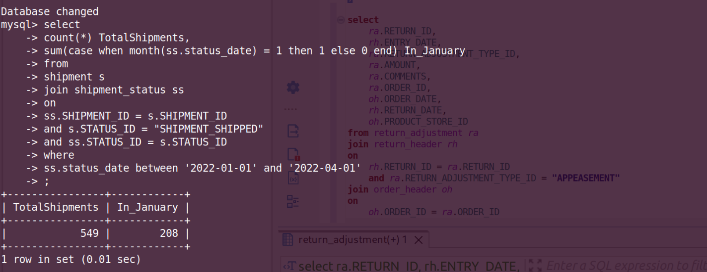

**Query:**

Total number of shipments in January 2022 first quarter:

- Determine the total count of shipments made during the first quarter of 2022, specifically in the month of January.

**Query cost:** 3083

**Solution:**

```sql
select
    count(*) TotalShipments,
    sum(case when month(ss.status_date) = 1 then 1 else 0 end) In_January
from
    shipment s
join shipment_status ss
on
    ss.SHIPMENT_ID = s.SHIPMENT_ID
    and s.STATUS_ID = "SHIPMENT_SHIPPED"
    and ss.STATUS_ID = s.STATUS_ID
where
    ss.status_date between '2022-01-01' and '2022-04-01'
;
```


