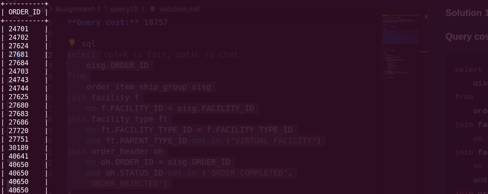

**Query:**

Orders brokered but not shipped:

- Identify orders that have been brokered (arranged or negotiated) but have not been shipped yet or shipment has not yet been created/initiated.

**Solution 1:**

**Query cost:** 18757

```sql
select
    oisg.ORDER_ID
from
    order_item_ship_group oisg
join facility f
    on f.FACILITY_ID = oisg.FACILITY_ID
join facility_type ft
    on ft.FACILITY_TYPE_ID = f.FACILITY_TYPE_ID
    and ft.PARENT_TYPE_ID not in ("VIRTUAL_FACILITY")
join order_header oh
    on oh.ORDER_ID = oisg.ORDER_ID
    and oh.STATUS_ID not in ('ORDER_COMPLETED', 'ORDER_REJECTED')
;
```

**Solution 2:**

**Query cost:** 50241

```sql
select
    oisg.ORDER_ID
from
    order_item_ship_group oisg
join facility f
    on f.FACILITY_ID = oisg.FACILITY_ID
    and f.FACILITY_TYPE_ID not in (
        "NA",
        "VIRTUAL_FACILITY",
        "BACKORDER",
        "CONFIGURATION",
        "GENERAL_OPERATIONS",
        "PRE_ORDER",
        "SEND_SALE_QUEUE"
    )
join order_header oh
    on oh.ORDER_ID = oisg.ORDER_ID
    and oh.STATUS_ID not in ('ORDER_COMPLETED', 'ORDER_REJECTED');
```


