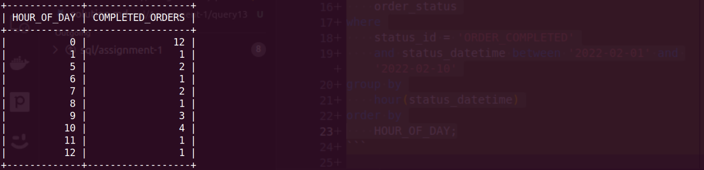

**Query:**

Orders completed hourly:

- Analyze and present the distribution of completed orders on an hourly basis.

**Query cost:** 6585

**Solution:**

```sql
select
    hour(status_datetime) HOUR_OF_DAY,
    count(*) as COMPLETED_ORDERS
from
    order_status
where
    status_id = 'ORDER_COMPLETED'
    and status_datetime between '2022-02-01' and '2022-02-10'
group by
    hour(status_datetime)
order by
    HOUR_OF_DAY;
```

| HOUR_OF_DAY | COMPLETED_ORDERS |
| ----------- | ---------------- |
| 0           | 12               |
| 1           | 1                |
| 5           | 2                |
| 6           | 1                |
| 7           | 2                |
| 8           | 1                |
| 9           | 3                |
| 10          | 4                |
| 11          | 1                |
| 12          | 1                |


