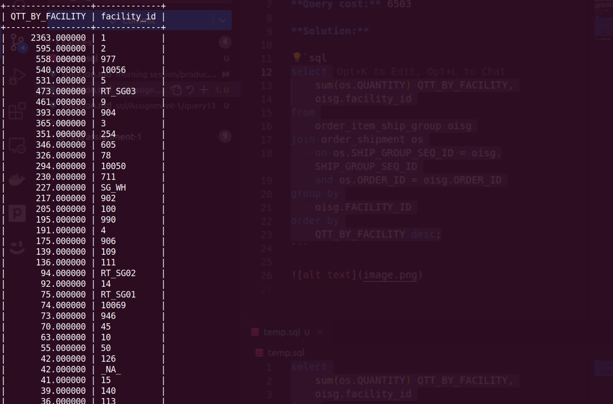

**Query:**

Maximum units fulfilled by location:

- Identify the location that has fulfilled the maximum number of units. This provides insights into the efficiency of different fulfillment centers.

**Query cost:** 6503

**Solution:**

```sql
select
    sum(os.QUANTITY) QTT_BY_FACILITY,
    oisg.facility_id
from
    order_item_ship_group oisg
join order_shipment os
    on os.SHIP_GROUP_SEQ_ID = oisg.SHIP_GROUP_SEQ_ID
    and os.ORDER_ID = oisg.ORDER_ID
group by
    oisg.FACILITY_ID
order by
    QTT_BY_FACILITY desc;
```



| QTT_BY_FACILITY | facility_id |
| --------------- | ----------- |
| 2363.000000     | 1           |
| 595.000000      | 2           |
| 558.000000      | 977         |
| 540.000000      | 10056       |
| 531.000000      | 5           |
| 473.000000      | RT_SG03     |
| 461.000000      | 9           |
| 393.000000      | 904         |
| 365.000000      | 3           |
| 351.000000      | 254         |
| 346.000000      | 605         |
| 326.000000      | 78          |
| 294.000000      | 10050       |
| 230.000000      | 711         |
| 227.000000      | SG_WH       |
| 217.000000      | 902         |
| 205.000000      | 100         |
| 195.000000      | 990         |
| 191.000000      | 4           |
| 175.000000      | 906         |
| 139.000000      | 109         |
| 136.000000      | 111         |
| 94.000000       | RT_SG02     |
| 92.000000       | 14          |
| 75.000000       | RT_SG01     |
| 74.000000       | 10069       |
| 73.000000       | 946         |
| 70.000000       | 45          |
| 63.000000       | 10          |
| 55.000000       | 50          |
| 42.000000       | 126         |
| 42.000000       | _NA_        |
| 41.000000       | 15          |
| 39.000000       | 140         |
| 36.000000       | 113         |
| 36.000000       | 10055       |
| 35.000000       | 7           |
| 33.000000       | 991         |
| 28.000000       | 77          |
| 24.000000       | 972         |
| 22.000000       | 44          |
| 20.000000       | 556         |
| 19.000000       | 57          |
| 19.000000       | 123         |
| 18.000000       | 85          |
| 16.000000       | 102         |
| 16.000000       | 905         |
| 16.000000       | 127         |
| 15.000000       | 10057       |
| 14.000000       | 25          |
| 14.000000       | 74          |
| 13.000000       | 10059       |
| 12.000000       | 10058       |
| 12.000000       | 10061       |
| 12.000000       | 10060       |
| 12.000000       | 10052       |
| 11.000000       | 103         |
| 10.000000       | 131         |
| 10.000000       | 10064       |
| 9.000000        | 10051       |
| 9.000000        | 145         |
| 9.000000        | 10063       |
| 9.000000        | 17          |
| 8.000000        | SM_WH       |
| 8.000000        | 924         |
| 7.000000        | 511         |
| 7.000000        | 114         |
| 7.000000        | 38          |
| 7.000000        | 530         |
| 7.000000        | 527         |
| 6.000000        | 10065       |
| 6.000000        | 22          |
| 6.000000        | 70          |
| 6.000000        | 104         |
| 6.000000        | 10053       |
| 6.000000        | 79          |
| 5.000000        | 147         |
| 5.000000        | 10054       |
| 5.000000        | 19          |
| 5.000000        | 71          |
| 5.000000        | 146         |
| 5.000000        | 119         |
| 5.000000        | 137         |
| 5.000000        | 73          |
| 4.000000        | 28          |
| 4.000000        | 75          |
| 4.000000        | 81          |
| 4.000000        | 561         |
| 4.000000        | 510         |
| 4.000000        | 141         |
| 4.000000        | 82          |
| 4.000000        | 83          |
| 3.000000        | 975         |
| 3.000000        | 976         |
| 3.000000        | 42          |
| 3.000000        | 128         |
| 3.000000        | 135         |
| 3.000000        | 134         |
| 2.000000        | 129         |
| 2.000000        | 926         |
| 2.000000        | 120         |
| 2.000000        | 124         |
| 2.000000        | 922         |
| 2.000000        | 96          |
| 2.000000        | 10062       |
| 2.000000        | 72          |
| 2.000000        | 522         |
| 2.000000        | 10066       |
| 2.000000        | 48          |
| 1.000000        | 144         |
| 1.000000        | 566         |
| 1.000000        | 533         |
| 1.000000        | 121         |
| 1.000000        | 544         |
| 1.000000        | 568         |
| 1.000000        | 548         |
| 1.000000        | 520         |
| 1.000000        | 133         |
