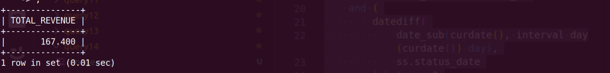

**Query:**

Shipping Revenue last month:

- Determine the total revenue generated from shipping in the last month.

**Query cost:** 25529

**Solution:**

```sql
select
    sum(oa.AMOUNT) TOTAL_REVENUE
from
    shipment_status ss
join shipment s
    on s.SHIPMENT_ID = ss.SHIPMENT_ID
    and ss.STATUS_ID = 'SHIPMENT_SHIPPED'
    and s.STATUS_ID = ss.STATUS_ID
    and (
        datediff(
            date_sub(curdate(), interval day(curdate()) day),
            ss.status_date
        ) between 0
        and 30
    )
join order_adjustment oa
    on s.PRIMARY_ORDER_ID = oa.ORDER_ID
    and oa.ORDER_ADJUSTMENT_TYPE_ID = 'SHIPPING_CHARGES'
;
```



| TOTAL_REVENUE |
| ------------- |
| 167.400       |
