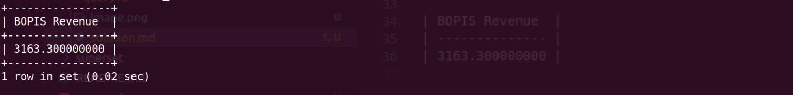

**Query:**

BOPIS orders Revenue in the last year:

- Calculate the revenue generated from BOPIS orders over the past year.

**Query cost:** 10535

**Solution:**

```sql
select
    sum(oi.UNIT_PRICE * oisga.QUANTITY) "BOPIS Revenue"
from
    order_item_ship_group_assoc oisga
join order_item oi
    on oi.ORDER_ID = oisga.ORDER_ID
    and oi.ORDER_ITEM_SEQ_ID = oisga.ORDER_ITEM_SEQ_ID
    and oi.STATUS_ID = "ITEM_COMPLETED"
join order_status os
    on os.STATUS_ID = oi.STATUS_ID
    and oi.ORDER_ID = os.ORDER_ID
    and oi.ORDER_ITEM_SEQ_ID = os.ORDER_ITEM_SEQ_ID
join order_item_ship_group oisg
    on oisga.ORDER_ID = oisg.ORDER_ID
    and oisga.SHIP_GROUP_SEQ_ID = oisg.SHIP_GROUP_SEQ_ID
    and oisg.SHIPMENT_METHOD_TYPE_ID = "STOREPICKUP"
where
    year(os.STATUS_DATETIME) + 1 = year(curdate());
```



| BOPIS Revenue  |
| -------------- |
| 3163.300000000 |
