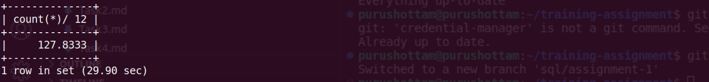

**Query:**

Average number of shipments per month:

- Calculate the average number of shipments made per month by dividing the total number of shipments by the number of months.

**Query cost:** 2043

**Solution:**

```sql
select
    count(*)/ 12
from
    shipment_status ss
where
    year(ss.STATUS_DATE) = 2022
    and ss.STATUS_ID = "SHIPMENT_SHIPPED";
```


