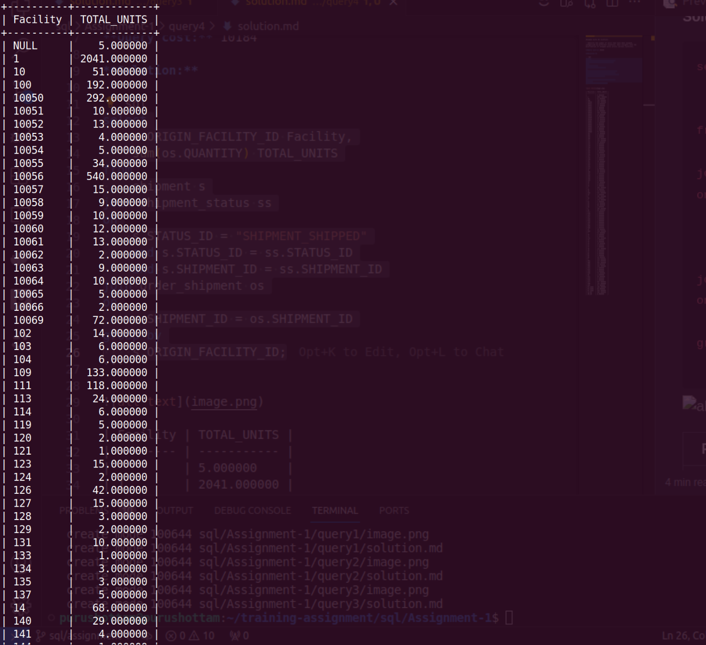

**Query:**

Shipped units By Location:

- Identify the number of units that have been shipped, categorized by different locations. Gain insights into the distribution of shipped units across various locations.

**Query cost:** 14173

**Solution:**

```sql
select
    s.ORIGIN_FACILITY_ID Facility,
    sum(os.QUANTITY) TOTAL_UNITS
from
    shipment s
join shipment_status ss
on
    s.STATUS_ID = "SHIPMENT_SHIPPED"
    and s.STATUS_ID = ss.STATUS_ID
    and s.SHIPMENT_ID = ss.SHIPMENT_ID
join order_shipment os
on
    s.SHIPMENT_ID = os.SHIPMENT_ID
group by
    s.ORIGIN_FACILITY_ID;
```



| Facility | TOTAL_UNITS |
| -------- | ----------- |
|          | 5.000000    |
| 1        | 2041.000000 |
| 10       | 51.000000   |
| 100      | 192.000000  |
| 10050    | 292.000000  |
| 10051    | 10.000000   |
| 10052    | 13.000000   |
| 10053    | 4.000000    |
| 10054    | 5.000000    |
| 10055    | 34.000000   |
| 10056    | 540.000000  |
| 10057    | 15.000000   |
| 10058    | 9.000000    |
| 10059    | 10.000000   |
| 10060    | 12.000000   |
| 10061    | 13.000000   |
| 10062    | 2.000000    |
| 10063    | 9.000000    |
| 10064    | 10.000000   |
| 10065    | 5.000000    |
| 10066    | 2.000000    |
| 10069    | 72.000000   |
| 102      | 14.000000   |
| 103      | 6.000000    |
| 104      | 6.000000    |
| 109      | 133.000000  |
| 111      | 118.000000  |
| 113      | 24.000000   |
| 114      | 6.000000    |
| 119      | 5.000000    |
| 120      | 2.000000    |
| 121      | 1.000000    |
| 123      | 15.000000   |
| 124      | 2.000000    |
| 126      | 42.000000   |
| 127      | 15.000000   |
| 128      | 3.000000    |
| 129      | 2.000000    |
| 131      | 10.000000   |
| 133      | 1.000000    |
| 134      | 3.000000    |
| 135      | 3.000000    |
| 137      | 5.000000    |
| 14       | 68.000000   |
| 140      | 29.000000   |
| 141      | 4.000000    |
| 144      | 1.000000    |
| 145      | 8.000000    |
| 146      | 3.000000    |
| 147      | 5.000000    |
| 15       | 41.000000   |
| 17       | 8.000000    |
| 19       | 4.000000    |
| 2        | 500.000000  |
| 22       | 6.000000    |
| 25       | 14.000000   |
| 254      | 327.000000  |
| 28       | 4.000000    |
| 3        | 282.000000  |
| 38       | 4.000000    |
| 4        | 176.000000  |
| 42       | 3.000000    |
| 44       | 13.000000   |
| 45       | 68.000000   |
| 48       | 2.000000    |
| 5        | 208.000000  |
| 50       | 45.000000   |
| 511      | 7.000000    |
| 520      | 1.000000    |
| 522      | 1.000000    |
| 527      | 7.000000    |
| 530      | 7.000000    |
| 533      | 1.000000    |
| 544      | 1.000000    |
| 561      | 1.000000    |
| 566      | 1.000000    |
| 568      | 1.000000    |
| 57       | 19.000000   |
| 605      | 330.000000  |
| 7        | 31.000000   |
| 70       | 6.000000    |
| 71       | 5.000000    |
| 711      | 218.000000  |
| 72       | 2.000000    |
| 73       | 5.000000    |
| 74       | 14.000000   |
| 75       | 4.000000    |
| 77       | 7.000000    |
| 78       | 325.000000  |
| 79       | 6.000000    |
| 81       | 4.000000    |
| 82       | 4.000000    |
| 83       | 4.000000    |
| 85       | 18.000000   |
| 9        | 134.000000  |
| 902      | 217.000000  |
| 904      | 361.000000  |
| 905      | 16.000000   |
| 906      | 115.000000  |
| 922      | 2.000000    |
| 924      | 8.000000    |
| 926      | 2.000000    |
| 946      | 72.000000   |
| 96       | 2.000000    |
| 972      | 24.000000   |
| 975      | 3.000000    |
| 976      | 3.000000    |
| 977      | 557.000000  |
| 990      | 181.000000  |
| 991      | 33.000000   |
| RT_SG01  | 102.000000  |
| RT_SG02  | 89.000000   |
| RT_SG03  | 464.000000  |
| SG_WH    | 203.000000  |
| SM_WH    | 8.000000    |
