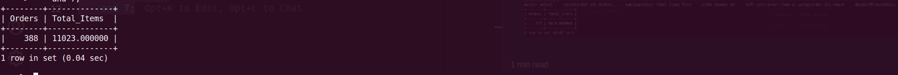
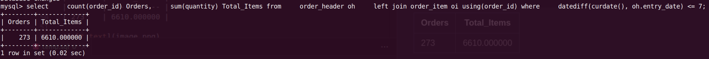

**Query:**

Last week imported orders & items count:

- Identify and count the orders and items that were imported in the system during the last week.

**Solution 1:**

**Query cost:** 70027

```sql
select
    count(order_id) Orders,
    sum(quantity) Total_Items
from
    order_header oh
    join order_item oi using(order_id)
where
    datediff(
        date_sub(curdate(), interval weekday(curdate()) day),
        oh.entry_date
    ) between 0
    and 7;
```

| Orders | Total_Items  |
| ------ | ------------ |
| 388    | 11023.000000 |



**Solution 2:**
Older way, If we consider the last week as last 7 days

**Query cost:** 70027

```sql
select
    count(order_id) Orders,
    sum(quantity) Total_Items
from
    order_header oh
    left join order_item oi using(order_id)
where
    datediff(curdate(), oh.entry_date) <= 7;
```

| Orders | Total_Items |
| ------ | ----------- |
| 273    | 6610.000000 |


