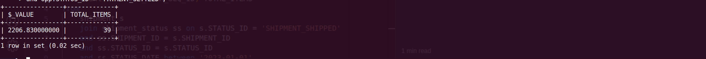

**Query:**

Total $ value of shipments shipped from facility 904/906 to first quarter:

- Calculate the total monetary value of shipments that originated from facilities 904 and 906 during the first quarter.

**Query cost:** 601

**Solution:**

```sql
select
    sum(oi.UNIT_PRICE * os.QUANTITY) $_VALUE,
    count(oi.ORDER_ITEM_SEQ_ID) TOTAL_ITEMS
from
    shipment s
join shipment_status ss
    on s.STATUS_ID = 'SHIPMENT_SHIPPED'
    and ss.SHIPMENT_ID = s.SHIPMENT_ID
    and ss.STATUS_ID = s.STATUS_ID
    and ss.STATUS_DATE between '2023-01-01' and '2023-04-01'
join facility f
    on
    s.ORIGIN_FACILITY_ID = f.FACILITY_ID
    and f.FACILITY_ID in ('904', '906')
join order_shipment os
    on
    os.SHIPMENT_ID = s.SHIPMENT_ID
join order_item oi
    on
    os.ORDER_ID = oi.ORDER_ID
    and os.ORDER_ITEM_SEQ_ID = oi.ORDER_ITEM_SEQ_ID
join order_payment_preference opp
    on
    os.ORDER_ID = opp.ORDER_ID
    and opp.STATUS_ID = 'PAYMENT_SETTLED';
```



| $\_VALUE       | TOTAL_ITEMS |
| -------------- | ----------- |
| 2206.830000000 | 39          |
