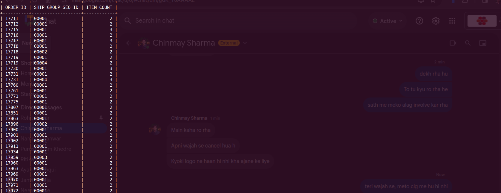

**Query:**

Orders that have more than one item in a single ship group:

**Query cost:** 7913

**Solution:**

```sql
select
    oisga.ORDER_ID,
    oisga.SHIP_GROUP_SEQ_ID,
    count(*) ITEM_COUNT
from
    order_item_ship_group_assoc oisga
group by
    oisga.ORDER_ID,
    oisga.SHIP_GROUP_SEQ_ID
having
    count(*)>1
;
```


