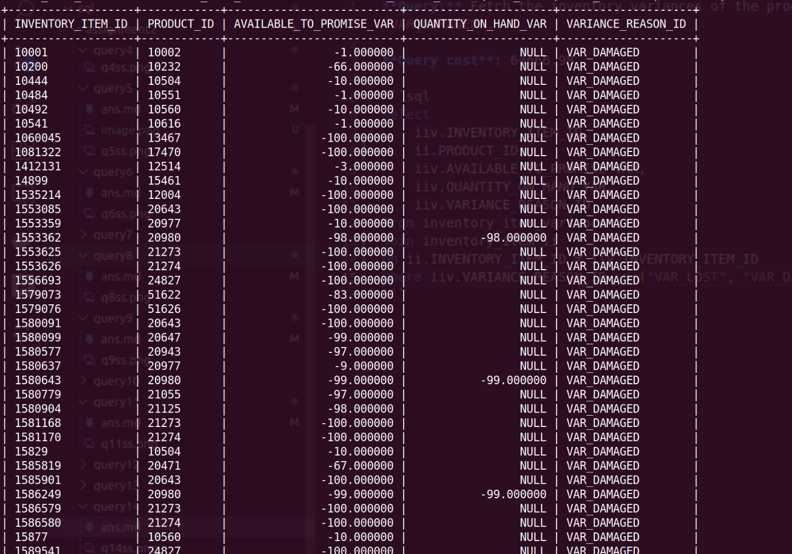

**Query:** Fetch the inventory variances of the products where the reason is `VAR_LOST` or `VAR_DAMAGED`.

**Query cost**: 64666.98

```sql
select
	iiv.INVENTORY_ITEM_ID,
	ii.PRODUCT_ID,
	iiv.AVAILABLE_TO_PROMISE_VAR,
	iiv.QUANTITY_ON_HAND_VAR,
	iiv.VARIANCE_REASON_ID
from inventory_item_variance iiv
join inventory_item ii
on ii.INVENTORY_ITEM_ID = iiv.INVENTORY_ITEM_ID
where iiv.VARIANCE_REASON_ID in ("VAR_LOST", "VAR_DAMAGED");
```


