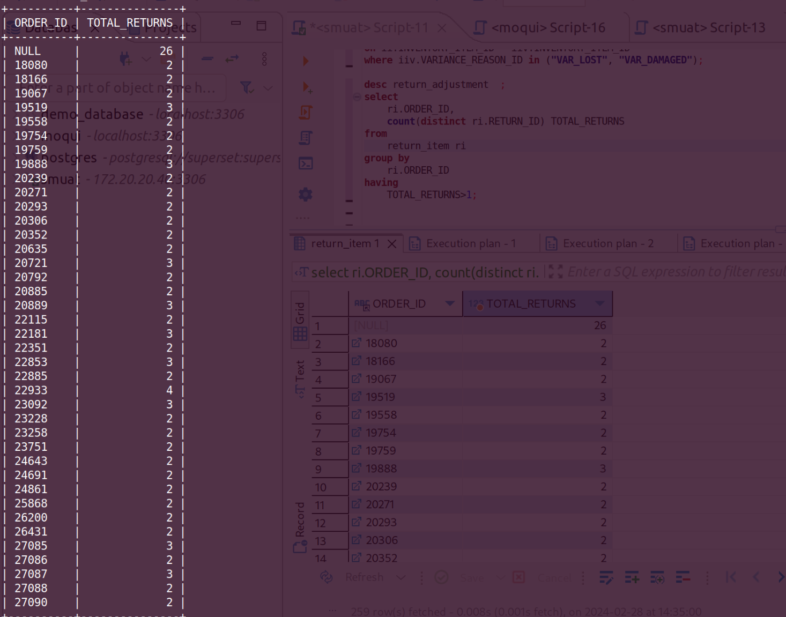

**Query:** Find all the orders that have more than one return.

**Query cost**: 158

```sql
select
	ri.ORDER_ID,
	count(distinct ri.RETURN_ID) TOTAL_RETURNS
from
	return_item ri
group by
	ri.ORDER_ID
having
	TOTAL_RETURNS>1;
```


