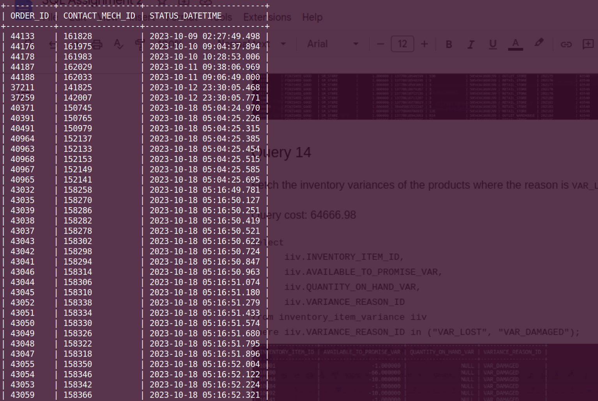

**Query:** Fetch the order id and contact mech id for the shipping address of the orders completed in October of 2023.

**Query cost**: 3484

```sql
select
	ocm.ORDER_ID,
	ocm.CONTACT_MECH_ID,
	os.STATUS_DATETIME
from
	order_contact_mech ocm
join order_header oh
	on oh.ORDER_ID = ocm.ORDER_ID
	and oh.STATUS_ID = "ORDER_COMPLETED"
join order_status os
	on oh.ORDER_ID = os.ORDER_ID
	and os.STATUS_ID = oh.STATUS_ID
	and ocm.CONTACT_MECH_PURPOSE_TYPE_ID = "SHIPPING_LOCATION"
where
	(os.STATUS_DATETIME between "2023-10-01" and "2023-10-31");
```



| ORDER_ID | CONTACT_MECH_ID | STATUS_DATETIME         |
| -------- | --------------- | ----------------------- |
| 44133    | 161828          | 2023-10-09 02:27:49.498 |
| 44176    | 161975          | 2023-10-10 09:04:37.894 |
| 44178    | 161983          | 2023-10-10 10:28:53.006 |
| 44187    | 162029          | 2023-10-11 09:38:06.969 |
| 44188    | 162033          | 2023-10-11 09:06:49     |
| 37211    | 141825          | 2023-10-12 23:30:05.468 |
| 37259    | 142007          | 2023-10-12 23:30:05.771 |
| 40371    | 150745          | 2023-10-18 05:04:24.970 |
| 40391    | 150765          | 2023-10-18 05:04:25.226 |
| 40491    | 150979          | 2023-10-18 05:04:25.315 |
| 40964    | 152137          | 2023-10-18 05:04:25.385 |
| 40963    | 152133          | 2023-10-18 05:04:25.454 |
| 40968    | 152153          | 2023-10-18 05:04:25.515 |
| 40967    | 152149          | 2023-10-18 05:04:25.585 |
| 40965    | 152141          | 2023-10-18 05:04:25.695 |
| 43032    | 158258          | 2023-10-18 05:16:49.781 |
| 43035    | 158270          | 2023-10-18 05:16:50.127 |
| 43039    | 158286          | 2023-10-18 05:16:50.251 |
| 43038    | 158282          | 2023-10-18 05:16:50.419 |
| 43037    | 158278          | 2023-10-18 05:16:50.521 |
| 43043    | 158302          | 2023-10-18 05:16:50.622 |
| 43042    | 158298          | 2023-10-18 05:16:50.724 |
| 43041    | 158294          | 2023-10-18 05:16:50.847 |
| 43046    | 158314          | 2023-10-18 05:16:50.963 |
| 43044    | 158306          | 2023-10-18 05:16:51.074 |
| 43045    | 158310          | 2023-10-18 05:16:51.180 |
| 43052    | 158338          | 2023-10-18 05:16:51.279 |
| 43051    | 158334          | 2023-10-18 05:16:51.433 |
| 43050    | 158330          | 2023-10-18 05:16:51.574 |
| 43049    | 158326          | 2023-10-18 05:16:51.680 |
| 43048    | 158322          | 2023-10-18 05:16:51.795 |
| 43047    | 158318          | 2023-10-18 05:16:51.896 |
| 43055    | 158350          | 2023-10-18 05:16:52.004 |
| 43054    | 158346          | 2023-10-18 05:16:52.122 |
| 43053    | 158342          | 2023-10-18 05:16:52.224 |
| 43059    | 158366          | 2023-10-18 05:16:52.321 |
| 43058    | 158362          | 2023-10-18 05:16:52.423 |
| 43057    | 158358          | 2023-10-18 05:16:52.529 |
| 37362    | 142305          | 2023-10-18 05:18:22.896 |
| 44255    | 162311          | 2023-10-20 10:26:05.988 |
| 44254    | 162307          | 2023-10-20 10:29:01.607 |
| 44252    | 162299          | 2023-10-20 10:34:50.142 |
| 44251    | 162295          | 2023-10-20 11:35:36.395 |
| 44256    | 162315          | 2023-10-20 11:37:55.431 |
| 44253    | 162303          | 2023-10-20 12:00:19.661 |
| 44261    | 162335          | 2023-10-20 12:37:56.556 |
| 44270    | 162361          | 2023-10-23 17:30:00.470 |
| 44257    | 162319          | 2023-10-25 07:26:13.299 |
| 44282    | 162399          | 2023-10-26 11:50:10     |
| 44284    | 162417          | 2023-10-27 04:34:14.768 |
| 37992    | 144049          | 2023-10-30 23:30:00.888 |
| 44599    | 163221          | 2023-10-03 01:32:13     |
