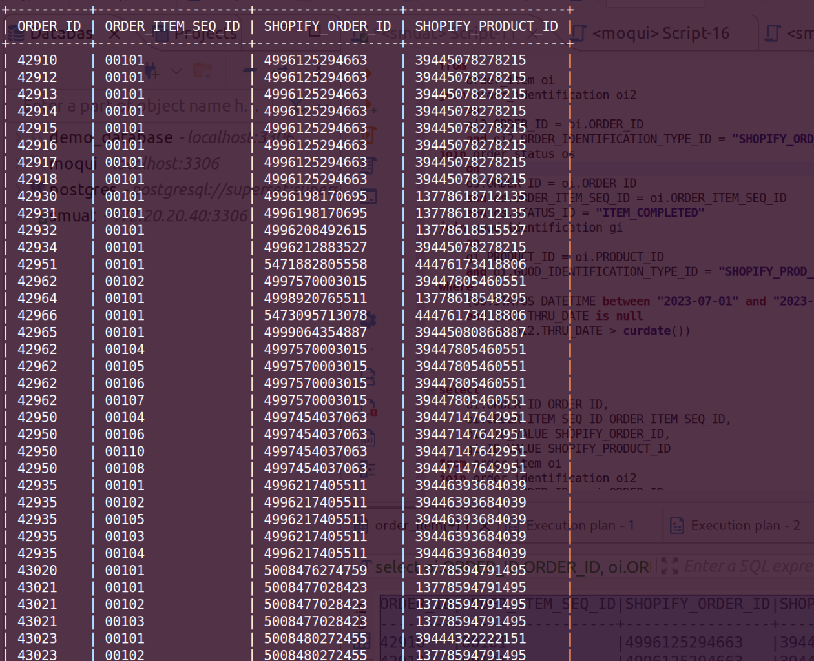

**Query:** Fetch the following data for completed order items in July of 2023

- ORDER_ID
- ORDER_ITEM_SEQ_ID
- SHOPIFY_ORDER_ID
- SHOPIFY_PRODUCT_ID

**Query cost**: 111876.20

```sql
select
	oi.ORDER_ID ORDER_ID,
	oi.ORDER_ITEM_SEQ_ID ORDER_ITEM_SEQ_ID,
	oi2.ID_VALUE SHOPIFY_ORDER_ID,
	gi.ID_VALUE SHOPIFY_PRODUCT_ID
from
	order_item oi
join order_identification oi2
	on
	oi2.ORDER_ID = oi.ORDER_ID
	and oi2.ORDER_IDENTIFICATION_TYPE_ID = "SHOPIFY_ORD_ID"
join order_status os
	on
	os.ORDER_ID = oi.ORDER_ID
	and os.ORDER_ITEM_SEQ_ID = oi.ORDER_ITEM_SEQ_ID
	and os.STATUS_ID = "ITEM_COMPLETED"
join good_identification gi
	on
	gi.PRODUCT_ID = oi.PRODUCT_ID
	and gi.GOOD_IDENTIFICATION_TYPE_ID = "SHOPIFY_PROD_ID"
where
	(os.STATUS_DATETIME between "2023-07-01" and "2023-07-31")
	and (oi2.THRU_DATE is null
		or oi2.THRU_DATE > curdate())
;
```


