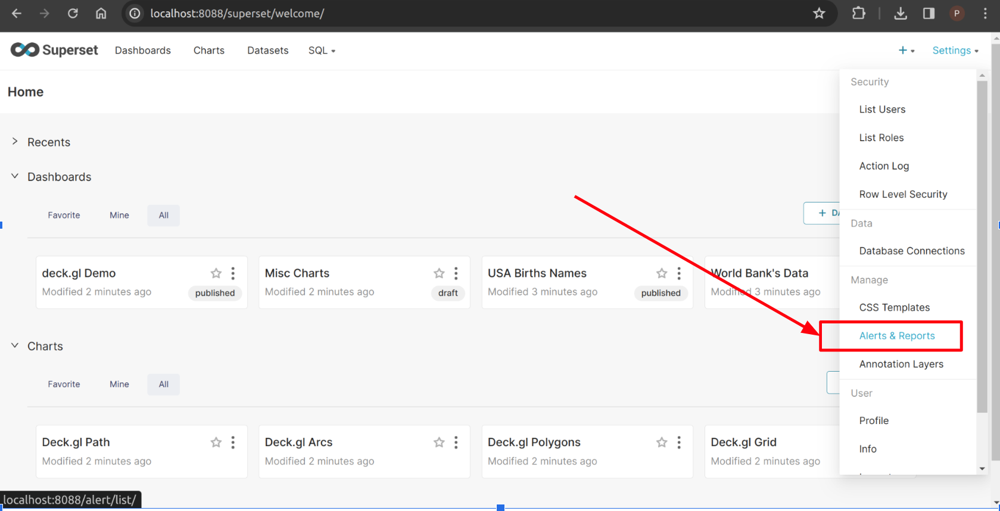
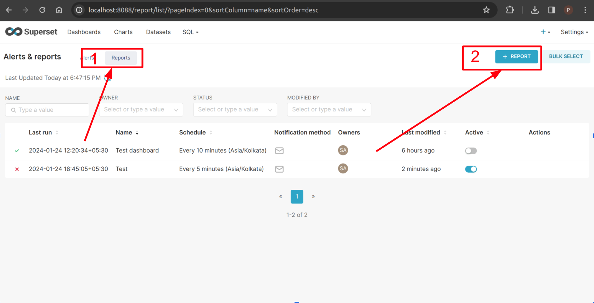
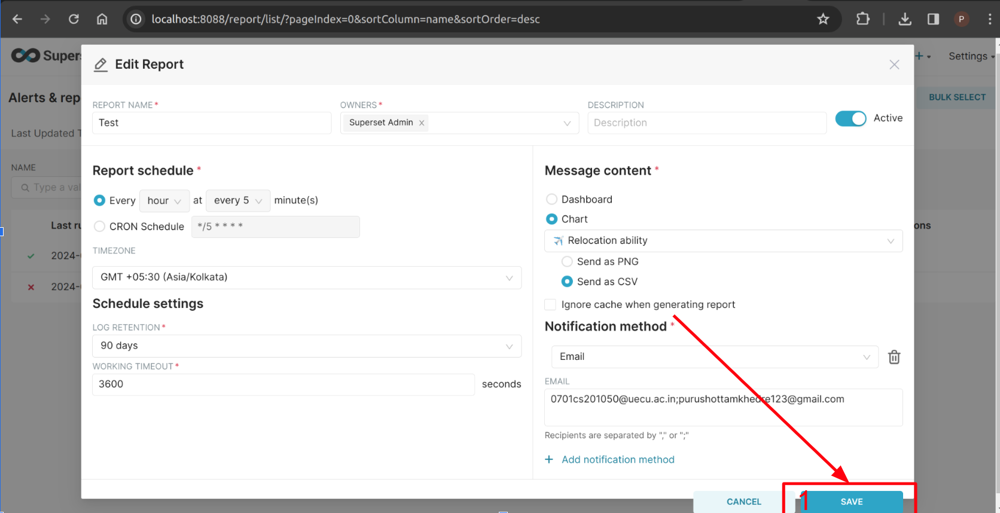

# Superset: Task 3

**Task:** Enabling email reporting in the superset this time using Gmail.

## Prequisites

* Superset installed
* gmail SMTP server credentials
  * google app password &
  * gmail

## Steps

1. Modify superset config

Edit or modify the code accordingly in the `superset_config.py` file

```py
FEATURE_FLAGS = {"ALERT_REPORTS": True}

# If this is true then emails are'nt actually send just job schedules, preparing data then completed
ALERT_REPORTS_NOTIFICATION_DRY_RUN = False

WEBDRIVER_BASEURL = "http://localhost:8088/"

# SMTP configuration
SMTP_HOST = "smtp.gmail.com"
SMTP_STARTTLS = True
SMTP_SSL = False
# SMTP_USER is email address which is used while creating a google app password
SMTP_USER = "YOUR_USER"
SMTP_PORT = 587
SMTP_PASSWORD = "YOUR_APP_PASSWORD"
SMTP_MAIL_FROM = "YOUR_EMAIL"
# If True creates a default SSL context with ssl.Purpose.CLIENT_AUTH using the
# default system root CA certificates.
SMTP_SSL_SERVER_AUTH = False
```

2. Create a report


