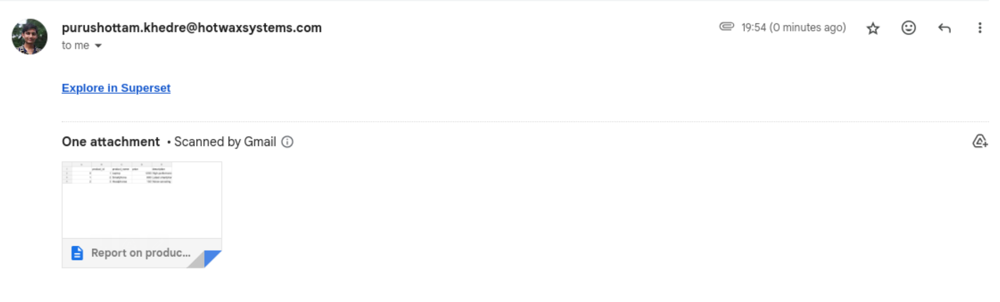
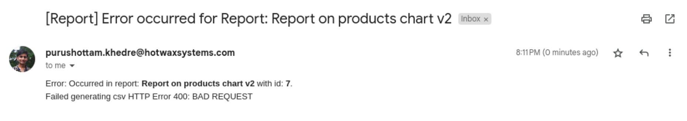
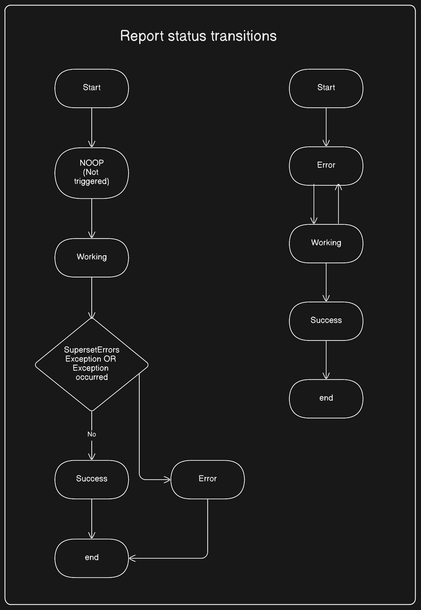

# Superset: Task 6

## Task

There is issue that when-ever an email failed because of the file were empty which it tries to sent. In that case an fallback error email sent to the user who created that email-report.

But problem is that There is no description about the Report-Failed Details.

1. Generate the issue on your local-end
2. Find the source-code where this logic working
3. Implement changes to add the Reports Details on the **fallback error email sent**


---

## Steps to reproduce the issue

We can reproduce this issue (when a fallback email is sent to the author of the report) by deleting/renaming the datasource whose base for the report

1. Log into a database shell

    ```sh
    # Login to database container
    docker exec -it superset_db /bin/bash

    # Then login to database shell, in my case I'm using postgreSQL
    psql -U superset
    ```

2. Create a table in examples database

    ```sql
    -- Selecting examples database
    \c examples

    -- Creting a product table
    CREATE TABLE products (
        product_id SERIAL PRIMARY KEY,
        product_name VARCHAR(100) NOT NULL,
        price NUMERIC(10, 2) NOT NULL,
        description TEXT
    );

    -- Inserting some data
    INSERT INTO products (product_name, price, description) VALUES
        ('Laptop', 1200.00, 'High-performance laptop with SSD storage'),
        ('Smartphone', 800.00, 'Latest smartphone model with dual-camera setup'),
        ('Headphones', 150.00, 'Noise-canceling headphones with Bluetooth connectivity');
    
    -- Grant all previleges to all users for products table
    GRANT ALL PRIVILEGES ON TABLE products TO PUBLIC;
    ```

3. Creating dataset on this product table
4. Then create a chart or include chart in any dashboard on this product table, so we can create a report.
5. Then create a report with this chart/dashboard. We get a email successfully

6. Now delete or rename the products table so that job can fails in fetching data.

    ```sql
    ALTER TABLE products RENAME TO products_renamed;
    ```

7. Now while fetch details of the chart, the email report fails and fallback email is sent to the author of the report.
**Before moutation**


## Various report status transitions



## How I mutate the fallback error email

* There is `BaseReport.send_error()` Method which triggered whenever a `SupersetErrorsException` and `Exception` is occured
